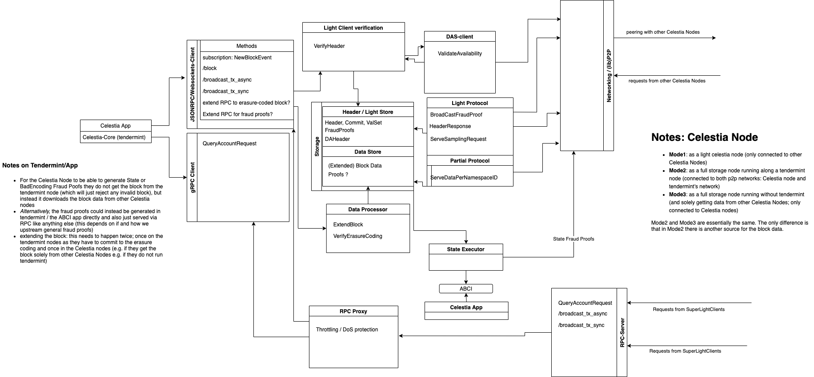

# ADR #001: Devnet Celestia Node

## Authors

@renaynay @Wondertan @liamsi

## Changelog

* 2021-08-19: initial draft

## Legend

**Celestia Core** = tendermint consensus node that lives in [the celestia-core repository](https://github.com/celestiaorg/celestia-core).

**Celestia Node** = celestia `full` or `light` nodes that live in [this repository](https://github.com/celestiaorg/celestia-node).

## Context

This ADR describes a basic pre-devnet design for a "Celestia Node" that was decided at the August 2021 Kyiv offsite that will ideally be completed in early November 2021 and tested in the first devnet.

The goal of this design is to get a basic structure of "Celestia Node" interoperating with a "Celestia Core" consensus node by November 2021 (devnet).

After basic interoperability on devnet, there will be an effort to merge consensus functionality into the "Celestia Node" design as a modulor service that can be added on top of the basic functions of a "Celestia Node".

## Decision

A "Celestia Node" will be distinctly different than a "Celestia Core" node in the initial implementation for devnet, with plans to merge consensus core functionality into the general design of a "Celestia Node", just added as an additional `ConsensusService` on the node.

For devnet, we require two modes for the Celestia Node: `light` and `full`, where the `light` node performs data availability sampling and the `full` node processes, stores, and serves new blocks from either Celestia Core consensus nodes *(required for devnet)* or from other Celestia `full` nodes *(optional for devnet)*.

**For devnet, a `light` Celestia Node must be able to do the following:**

* propagate relevant block information (in the form of `ExtendedHeader`s and `BadEncodingFraudProof`s) to its "Celestia Node" peers
* verify `ExtendedHeader`s
* perform and serve sampling and `SharesByNamespace` requests *(note: light nodes serve the `Shares` that they've already requested and stored by default as a result of the way bitswap works -- with bitswap, if a node has something another node wants, it will serve it)*
* request `State` to get `AccountBalance` in order to submit transactions

**For devnet, a `full` Celestia Node must be able to do everything a `light` Celestia Node does, in addition to the following:**

* receive "raw" (un-erasure coded) blocks from a "Celestia Core" node by subscribing to `NewBlockEvents` using the `/block` RPC endpoint of "Celestia Core" node
* erasure code the block / verify erasure coding
* create an `ExtendedHeader` with the raw block header, the generated `DataAvailabilityHeader` (DAH), as well as the `ValidatorSet` and serve this `ExtendedHeader` to the Celestia network
* request "raw" blocks from other `full` Celestia Nodes on the network *(optional for devnet)*

## Detailed Design

The Celestia Node will have a central `Node` data structure around which all services will be focused. A "service" is any kind of data retrieval/sharing/storage process that can be started and stopped on the core node. For example, everything related to retrieving blocks, erasure coding them, verifying them, and storing them will be contained in a `BlockService` which can be configured, registered, and started on the node.

A user will be able to initialise a Celestia Node as either a `full` or `light` node. Upon start, the `Node` gets created, configured and will also configure services to register on the `Node` based on the node type (`light` or `full`).

A `full` node encompasses the functionality of a `light` node along with additional services that allow it to interact with a Celestia Core node.

A `light` node will provide the following services:

* `ExtendedHeaderService` -- a service that can be registered on the node, and started/stopped that contains every process related to retrieving `ExtendedHeader`s (actively or passively), as well as storing them.
  * `ExtendedHeaderExchange` (request/response)
  * `ExtendedHeaderSub` (broadcast)
  * `ExtendedHeaderStore`
* `FraudProofService` *(optional for devnet)* -- a service that can be registered on the node, and started/stopped that contains every process related to retrieving `BadEncodingFraudProof`s and `StateFraudProof`s.
  * `FraudProofSub` (broadcast)
  * `FraudProofStore`
* `ShareService` -- a service that can be registered on the node, and started/stopped that contains every process related to retrieving shares randomly (sampling) or by namespace from the network, as well as storage for those shares.
  * `ShareExchange` (request/response)
  * `ShareStore`
* `StateService` *(optional for devnet)* -- a service that can be registered on the node, and started/stopped that contains every process related to retrieving state for a given block height or account.
  * `StateExchange` (request/response)
* `TransactionService` *(dependent on `StateService` implementation, but optional for devnet)* -- a simple server that can be registered on the node, and started and stopped that handles for endpoints like `/submit_tx`
  * `SubmitTx` (request/response)

A `full` node will provide the following services:

* `ExtendedHeaderService` -- a service that can be registered on the node, and started/stopped that contains every process related to **generating**, propagating/retrieving `ExtendedHeader`s (actively or passively), as well as storing them.
  * `ExtendedHeaderExchange` (request/response)
  * `ExtendedHeaderVerification` (`full` nodes only)
  * `ExtendedHeaderSub` (broadcast)
  * `ExtendedHeaderStore`
* `FraudProofService` *(optional for devnet)* -- a service that can be registered on the node, and started/stopped that contains every process related to generating, broadcasting, and storing both `BadEncodingFraudProof`s and `StateFraudProof`s.
  * **`FraudProofGeneration`**
  * `FraudProofSub` (broadcast)
  * `FraudProofStore`
* `ShareService` -- a service that can be registered on the node, and started/stopped that contains every process related to requesting and providing shares. Note, `full` nodes will not have a separate `ShareStore` as the store the full blocks.
  * `ShareExchange` (request/response)
* `BlockService`
  * `BlockErasureCoding`
  * `NewBlockEventSubscription` (`full` node <> `Celestia Core` node request)
  * `BlockExchange` *(optional for devnet)* (`full` node <> `full` node request/response)
  * `BlockStore`
* `StateService` *(optional for devnet)*
  * `StateExchange` (`full` node <> Celestia Core request/response)
* `TransactionService` *(dependent on `StateService` implementation, but optional for devnet)*
  * `SubmitTx`

For devnet, it should be possible for Celestia `full` Nodes to receive information directly from Celestia Core nodes or from each other.

## Considerations

### State Fraud Proofs

For the Celestia Node to be able to propagate `StateFraudProof`s, we must modify Celestia Core to store blocks with invalid state and serve them to both the Celestia Node and the Celestia App, **and** the Celestia App must be able to generate and serve `StateFraudProof`s via RPC to Celestia nodes.

This feature is not necessarily required for devnet (so state execution functionality for Celestia Full Nodes can be stubbed out), but it would be nice to have for devnet as we will likely allow Celestia Full Nodes to speak with other Celestia Full Nodes instead of running a trusted Celestia Core node simultaneously and relying on it for information.

A roadmap to implementation could look like the following:

The Celestia Full Node would adhere to the ABCI interface in order to communicate with the Celestia App (similar to the way Optimint does it). The Celestia Full Node would send State requests to the Celestia App in order for the Celestia app to replay the transactions in the block and verify the state. Alternatively, Celestia Full Nodes would also be able to replay the transactions in order to verify state / generate state fraud proofs on its own.

For devnet, it is okay to stub out state verification functionality. For example, a Celestia Full Node would download reserve transactions, but not replay them.

### Fraud Proofs

For validators (Celestia Core) to be able to sign blocks, they need to erasure code the block data and commit to the data root of the erasure coded block that is stored in the header. The validators do not need to store the erasure coded block, but only the "raw" block with the data root in the header. A Celestia Node will fetch the "raw" block from Celestia Core via the `/block` endpoint, and then erasure code the block, checking it against the data root in the header, and then store the erasure coded block.

For devnet, the Celestia Node will not be able to generate state fraud proofs as it will not have a state execution environment, so it will rely on Celestia Core to produce state fraud proofs and retrieve the proof via a `/state_fraud` endpoint. The Celestia Node will also require the "state fraudulent" block, so Celestia Core needs to make those blocks available via the `/block` endpoint.

### Light nodes serving shares and samples

At the moment, we will be using [bitswap](https://github.com/ipfs/go-bitswap) to retrieve samples and shares from the network. The way Bitswap works requires nodes that have the requested data to serve it. This is not necessarily ideal for a "light node" to do as supporting serving samples/shares would expand the resource requirements for a light node.

Other negatives of bitswap include:

* it somewhat couples storage with networking (e.g. it will be difficult to just compute the inner proof nodes on demand instead of storing them) by default
* it requires multiple roundtrips for what could be a single (or at least fewer) roundtrip(s) if we wrote our own protocol; this is particularly relevant in the case where Celestia nodes will run on their own and download the whole block via the p2p network from other Celestia nodes (instead of from tendermint via RPC): the [current implementation](https://github.com/celestiaorg/celestia-core/blob/052d1269e0ec1de029e1cf3fc02d2585d7f9df10/p2p/ipld/read.go#L23-L30) using bitswap and ipfs is quite inefficient compared to a protocol that was not bitswap on a share-level
* more code we do not directly have control over and more dependencies

In the future, we should consider moving away from bitswap to either [GraphSync](https://github.com/ipfs/go-graphsync) or a custom protocol.

## Consequences

While this design is not ideal, it will get us to a devnet more quickly and allow us to iterate rather than try to design and implement the perfect Celestia node from the start.

### Positive

Iterative process will allow us to test out non-p2p-related functionality much sooner, and will allow us to incrementally approach debugging rather than trying to get the design/implementation perfect in one go.

### Negative

* We will end up throwing out a lot of the implementation work we do now since our eventual goal is to merge consensus functionality into the concept of a "Celestia Node".
* The current design requires erasure coding to be done twice and stores data twice (raw block in Celestia Core and erasure coded block in Celestia Node) which is redundant and should be consolidated in the future.

## Open Questions

Should Celestia Core nodes also generate and serve fraud proofs? Or only serve the invalid blocks to Celestia Full Nodes?

## Status

Proposed
