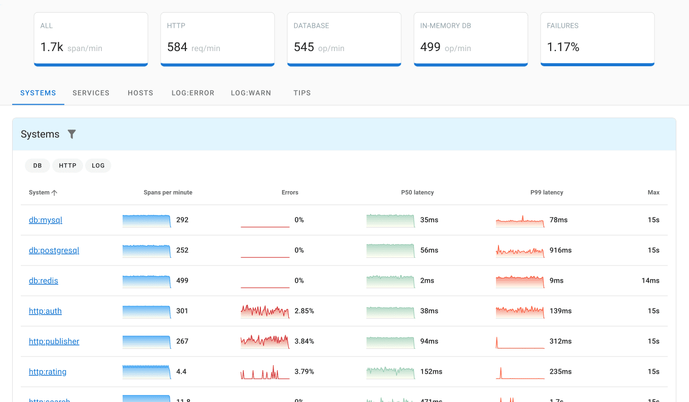
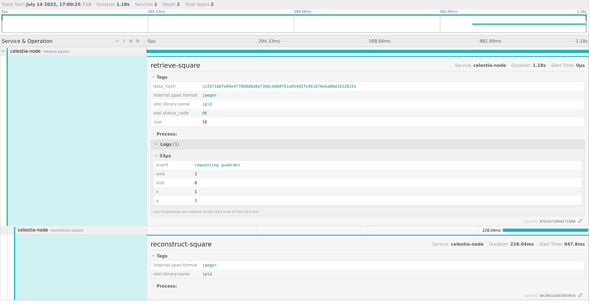

# ADR #009: Telemetry

## Changelog

* 2022-07-04: Started
* 2022-07-10: Initial Draft finished
* 2022-07-11: Stylistic improvements from @renaynay
* 2022-07-14: Stylistic improvements from @liamsi
* 2022-07-15: Stylistic improvements from @rootulp and @bidon15

## Authors 

@Wondertan @liamsi

## Glossary
- `ShrEx` - P2P Share Exchange Stack
> It's all ogre now

## Context
> Now I know why I don't like writing ADRs - because I cannot run/test them and see if they work or not.
> Hoping that quality team feedback will solve this problem!

Celestia Node needs deeper observability of each module and their components. The only integrated observability solution 
we have is logging and there are two more options we need to explore from the observability triangle(tracing, metrics and logs).

There are several priorities and "why"s we need deeper observability:
* Establishing metrics/data driven engineering culture for celestia-node devs
  * Metrics and tracing allows extracting dry facts out of any software on its performance, liveness, bottlenecks,
    regressions, etc., on whole system scale, so devs can reliably respond
  * Basing on these, all the improvements can be proven with data _before_ and _after_ a change
* Roadmap adjustment after analysis of the current `ShrEx` based on real world data from:
  * Full Node reconstruction qualities
  * Data availability sampling
* Incentivized Testnet
  * Tracking participants
  * Validating done tasks with transparent evidence
  * Harvesting valuable data/insight/traces that we can analyze and improve on
* Monitoring dashboards
  * For Celestia's own DA network infrastructure, e.g. DA Network Bootstrappers
  * For the node operators
* Extend debugging arsenal for the networking heavy DA layer
  * Local development
  * Issues found with [Testground testing](https://github.com/celestiaorg/test-infra)
  * Production

This ADR is intended to outline the decisions on how to proceed with:
* Integration plan according to the priorities and the requirements
* What observability tools/dependencies to integrate
* Integration design into Celestia-Node for each observability option
* A reference document explaining "whats" and "hows" during integration in some part of the codebase, e.g. new dev

## Decisions

### Plan

#### First Priority

The first priority lies on "ShrEx" stack analysis results  for Celestia project. The outcome will tell us whether
our current [Full Node reconstruction](https://github.com/celestiaorg/celestia-node/issues/602) qualities conforms to 
the main network requirements, subsequently affecting the development roadmap of the celestia-node before the main 
network launch. Basing on the former, the plan is focused on unblocking the reconstruction 
analysis first and then proceed with steady covering of our codebase with traces for the complex codepaths as well as 
metrics and dashboards for "measurables".

Fortunately, the `ShrEx` analysis can be performed with _tracing_ only(more on that in Tracing Design section below), 
so the decision for the celestia-node team is to cover with traces only the _necessary_ for the current "ShrEx" stack 
code as the initial response to the ADR, leaving the rest to be integrated in the background for the devs in the team 
once they are free as well as for the efficient bootstrapping into the code for the new devs.

#### Second Priority

The next biggest priority - incentivized Testnet can be largely covered with traces as well. All participant will submit
traces from their nodes to any provided backend endpoint by us during the whole network lifespan. Later on, we will be 
able to verify the data of each participant by querying historical traces. This is the feature that some backend solutions 
provide, which we can use as well to extract valuable insight on how the network performs in macro view.

### Tooling/Dependencies

#### Golang API/Shim

The decision is to use [opentelemetry-go](https://github.com/open-telemetry/opentelemetry-go) for both Metrics and Tracing:
* Minimal and golang savvy API/shim which gathers years of experience from OpenCensus/OpenMetrics and [CNCF](https://www.cncf.io/)
* Backends/exporters for all the existing timeseries monitoring DBs, e.g. Prometheus, InfluxDB. As well as tracing backends
  Jaeger, Uptrace, etc.
* https://github.com/uptrace/opentelemetry-go-extra/tree/main/otelzap with logging engine with use - Zap

The discussion over this decision can be found in [celestia-node#663](https://github.com/celestiaorg/celestia-node/issues/663)
and props to @liamsi for initial kickoff and a deep dive into OpenTelemetry.

#### Tracing Backends

For tracing, there are 3 modern OSS tools that are recommended. All of them have bidirectional support with OpenTelemetry:
* [Uptrace](https://get.uptrace.dev/guide/#what-is-uptrace)
  * The most recent (~1 year)
  * The richest UI
  * Tight to Clickhouse DB
  * Made by OpenTelemetry
  * The most lightweight
* [Jaeger](https://www.jaegertracing.io/)
  * The most mature
  * Started by Uber, now supported by CNCF
  * Supports multiple storages(ScyllaDB, InfluxDB, Amazon DynamoDB)
* [Graphana Tempo](https://grafana.com/oss/tempo/)
  * Deep integration with Graphana/Prometheus
  * Relatively new (~2 years)
  * Uses Azure, GCS, S3 or local disk for storage

Each of these backends can be used independently and depending on the use case. For us, these are main use cases: 
* Local development/debugging for the private network or even public network setup
* Data collection from the Testground test runs
* Bootstrappers monitoring infrastructure
* Data collection from the incentivized testnet participants
> I am personally planning to set up the lightweight Uptrace for the local light node. Just to play around and observe
> things

There is no strict decision on which of these backends and where to use. People taking ownership of any listed vectors
are free to use any recommended solution or any unlisted.

#### Metrics Backend

// WIP

## Design

### Tracing Design

Tracing allows to see _how_ any process progresses through different modules, APIs and networks, as well as timings of 
each operation and any events or errors as they occur.

A visual example of a generic tracing dashboard provided via [Uptrace](https://uptrace.dev/) backend


Mainly, for `ShrEx` and reconstruction analysis we need to know if the reconstruction succeeded and the time it took for
the big block sizes(EDS >= 128). The tracing in this case would provide all the data for the whole reconstruction 
operation and for each sub operation within reconstruction, e.g time spend specifically on erasure coding
> NOTE: The exact compute time is not available unless [rsmt2d#107](https://github.com/celestiaorg/rsmt2d/issues/107)
> is fixed.

#### Spans

Span represents an operation (unit of work) in a trace. They keep the time when operation _started_ and _ended_. Any 
additional user defined _attributes_, operation status(success or error with an error itself) and events/logs that 
may happen during the operation.

Spans also form a parent tree, meaning that each span associated to a process can have multiple sub processes or child
spans and vise-versa. Altogether, this feature allows to see the whole trace of execution of any part of the system, no 
matter how complex it is. This is exactly what we need to analyze our reconstruction performance.

#### Integration Example

First, we define global pkg level tracer to create spans from within `ipld` pkg. Basically, it groups spans under 
common logical namespace and extends the full name of each span.
```go
var tracer = otel.Tracer("ipld")
```

Then, we define a root span in `ipld.Retriever`:
```go
import "go.opentelemetry.io/otel"

func (r *Retriever) Retrieve(ctx context.Context, dah *da.DataAvailabilityHeader) (*rsmt2d.ExtendedDataSquare, error) {
  ctx, span := tracer.Start(ctx, "retrieve-square")
  defer span.End()

  span.SetAttributes(
    attribute.Int("size", len(dah.RowsRoots)),
    attribute.String("data_hash", hex.EncodeToString(dah.Hash())),
  )
  ...
}
```

Next, the child span in `ipld.Retriever.Reconstruct`:
```go
	ctx, span := tracer.Start(ctx, "reconstruct-square")
	defer span.End()

	// and try to repair with what we have
	err := rs.squareImported.Repair(rs.dah.RowsRoots, rs.dah.ColumnRoots, rs.codec, rs.treeFn)
	if err != nil {
		span.RecordError(err)
		return nil, err
	}
```

And lastly, the quadrant request event:
```go
    span.AddEvent("requesting quadrant", trace.WithAttributes(
        attribute.Int("axis", q.source),
        attribute.Int("x", q.x),
        attribute.Int("y", q.y),
        attribute.Int("size", len(q.roots)),
    ))
```
> The above is only examples related to our code and is a subject to change.

Here is the result of the above code sending traces visualized on Jaeger UI


#### Backends connection 

Jaeger example
```go
    // Create the Jaeger exporter
    exp, err := jaeger.New(jaeger.WithCollectorEndpoint(jaeger.WithEndpoint(url)))
    if err != nil {
        return nil, err
    }
	// then the tracer provider
    tp := tracesdk.NewTracerProvider(
        // Always be sure to batch in production.
        tracesdk.WithBatcher(exp),
        // Record information about this application in a Resource.
        tracesdk.WithResource(resource.NewWithAttributes(
            semconv.SchemaURL,
            semconv.ServiceNameKey.String(service),
            attribute.String("environment", environment),
            attribute.Int64("ID", id),
        )),
    )
	// and set it globally to be used across packages
    otel.SetTracerProvider(tp)
	
	// then close it elsewhere
    tp.Shutdown(ctx)
```

### Metrics Design

// WIP

## Considerations

* Tracing performance
  * _Every_ method calling two more functions making network request can affect overall performance

## Other

As you will see in the examples below, tracing looks similar to logging and have almost the same semantics. In fact,
tracing is debug logging on steroids, and we can potentially consider dropping conventional _debug_ logging once we 
fully cover our codebases with the tracing. Same as logging, traces can be pipe out into the stdout as prettyprinted
event log.

## Further Readings
- [Uptrace tracing tools comparison](https://get.uptrace.dev/compare/distributed-tracing-tools.html)
- [Uptrace guide](https://get.uptrace.dev/guide/)
- [Uptrace OpenTelemetry Docs](https://opentelemetry.uptrace.dev/)
> Provides simple Go API guide for metrics and traces
- [OpenTelemetry Docs](https://opentelemetry.io/docs/)
- [Prometheus Docs](https://prometheus.io/docs/introduction/overview)

## Status
Proposed
