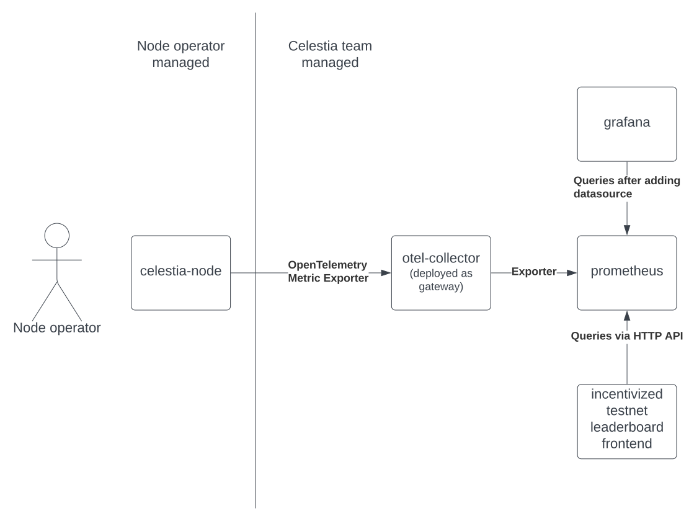

# ADR #010: Monitoring

## Changelog

- 2022-7-19: Started

## Context

We're adding telemetry to celestia-node by instrumenting our codebase with metrics (see [ADR-009-telemetry](./adr-009-telemetry.md)). These metrics will be pushed via [OLTP Explorter](https://opentelemetry.io/docs/reference/specification/protocol/exporter/) to an [OTLP Collector](https://opentelemetry.io/docs/collector/) instance.

We would like to make the metrics collected in OLTP Collector actionable by making them queryable in internal Grafana dashboards. We additionally want a subset of metrics to be queryable by a public incentivized testnet leaderboard front-end.

This document proposes a strategy for making data in an OTLP Collector available for use in internal Grafana dashboards and a public leaderboard.



// Comment on diagram <https://lucid.app/lucidchart/d957570f-9c06-4a82-9843-00d8232f734a/edit?invitationId=inv_247247d6-3a67-40b1-8513-1818caadd627>#

### Where to export data to?

Grafana can query data from [multiple data sources](https://grafana.com/docs/grafana/latest/datasources/#supported-data-sources). This document explores two of these data sources:

1. [Prometheus](https://github.com/prometheus/prometheus) is an open-source time series database written in Go. Prometheus uses the [PromQL](https://prometheus.io/docs/prometheus/latest/querying/basics/) query language. We can deploy Prometheus ourselves or use a hosted Prometheus provider (ex. [Google](https://cloud.google.com/stackdriver/docs/managed-prometheus), [AWS](https://aws.amazon.com/prometheus/), [Grafana](https://grafana.com/go/hosted-prometheus-monitoring/), etc.). Prometheus is pull-based which means services that would like to expose Prometheus metrics must provide an HTTP endpoint (ex. `/metrics`) that a Prometheus instance can poll (see [instrumenting a Go application for Prometheus](https://prometheus.io/docs/guides/go-application/)). Prometheus is used by [Cosmos SDK telemetry](https://docs.cosmos.network/main/core/telemetry.html) and [Tendermint telemetry](https://docs.tendermint.com/v0.35/nodes/metrics.html) so one major benefit to using Prometheus is that metrics emitted by celestia-core, celestia-app, and celestia-node can share the same database.
1. [InfluxDB](https://github.com/influxdata/influxdb) is another open-source time series database written in Go. It is free to deploy the InfluxDB but there is a commercial offering from [influxdata](https://www.influxdata.com/get-influxdb/) that provides clustering and on-prem deployments. InfluxDB uses the [InfluxQL](https://docs.influxdata.com/influxdb/v1.8/query_language/) query language which appears less capable at advanced queries [ref](https://www.robustperception.io/translating-between-monitoring-languages/). InfluxDB is push-based which means services can push metrics directly to an InfluxDB instance ([ref](https://logz.io/blog/prometheus-influxdb/#:~:text=InfluxDB%20is%20a%20push%2Dbased,and%20Prometheus%20fetches%20them%20periodically.)). See [Prometheus vs. InfluxDB](https://prometheus.io/docs/introduction/comparison/#prometheus-vs-influxdb) for a more detailed comparison.

If alternative data sources should be evaluated, please share them with us.

### How to export data out of OLTP Collector?

[Exporters](https://opentelemetry.io/docs/collector/configuration/#exporters) provide a way to export data from an OLTP Collector to a supported destination.

We configure OLTP collector to export data to Prometheus like this:

```yaml
exporters:
  # Data sources: metrics
  prometheus:
    endpoint: "prometheus:8889"
    namespace: "default"
```

We must additionally enable this exporter via configuration like this:

```yaml
service:
  pipelines:
    metrics:
      exporters: [prometheus]
```

OLTP collector support for exporting to InfluxDB is still in [beta](https://github.com/open-telemetry/opentelemetry-collector#beta=). See [InfluxDB Exporter](https://pkg.go.dev/github.com/open-telemetry/opentelemetry-collector-contrib/exporter/influxdbexporter#section-readme).

### How to query data in Prometheus from Grafana?

In order to query Prometheus data from Grafana, we must add a Prometheus datasource. Steps outlined [here](https://prometheus.io/docs/visualization/grafana/#creating-a-prometheus-data-source).

### How to query data in Prometheus from incentivized testnet leaderboard?

Prometheus server exposes an HTTP API for querying metrics (see [docs](https://prometheus.io/docs/prometheus/latest/querying/api/#querying-exemplars)).

Implementation details for the incentivized testnet leaderboard are not yet known (likely built by an external vendor). Two possible implementations are:

1. If the incentivized testnet has a dedicated backend, it can query the HTTP API above
1. If the incentivized testnet has **no** dedicated backend and the frontend queries Prometheus directly, then there exists a TypeScript library: [prometheus-query-js](https://github.com/samber/prometheus-query-js) which may be helpful.

## Status

Proposed

## References

- <https://github.com/celestiaorg/celestia-node/pull/901>
- <https://celestia-team.slack.com/archives/C03QAJVLHK3/p1658169362548589>
- <https://www.notion.so/celestiaorg/Telemetry-Dashboard-d85550a3caee4004b00a2e3bf82619b1>
- <https://opentelemetry.io/docs/collector/>

## Open Questions

**Q:** Should we host a Prometheus instance ourselves or use a hosted provider?
**A:** We already host a Prometheus instance on DigitalOcean (host mamaki-prometheus). This seems like a good option during development and we can punt the decision of using a hosted provider to a later date.

**Q:** Should we host a Grafana instance ourselves or use a hosted provider?
**A:** We already host a Grafana instance on DigitalOcean (host mamaki-prometheus). This seems like a good option during development and we can punt the decision of using a hosted provider to a later date.

**Q:** Should we host separate Prometheus instances per use case? I.e. one for internal dashboards and one for public leaderboard?
**A:** The Prometheus docs state the following with regard to [Denial of Service](https://prometheus.io/docs/operating/security/#denial-of-service):
    > There are some mitigations in place for excess load or expensive queries. However, if too many or too expensive queries/metrics are provided components will fall over. It is more likely that a component will be accidentally taken out by a trusted user than by malicious action.
    So if we are concerned about the public leaderboard crashing the Prometheus instance that we use for internal dashboards, we may want to host two separate instances. This seems feasible by configuring OTEL Collector to export to two different Prometheus instances. This is a one way door, I suggest sticking with one instance for now and if we observe scenarios where the Prometheus instance falls over, we can explore a hosted option or running separate instances per use case.
