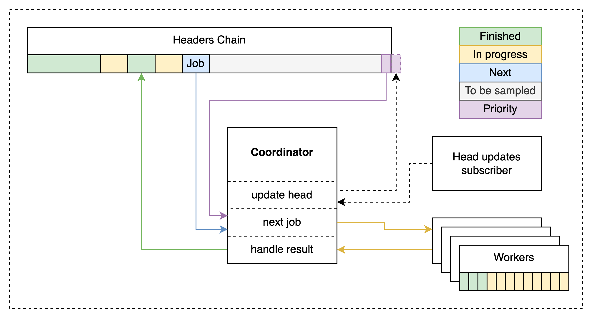

# ADR #012: DASer parallelization

## Changelog

- 2022-9-12: Started

## Authors

@walldiss

## Context

DAS is the process of verifying the availability of block data by sampling shares of those blocks. The `das` package implements an engine to ensure the availability of the chain's block data via the `Availability` interface.
Verifying the availability of block data is a priority functionality for celestia-node. Its performance could benefit significantly from parallelization optimisation to make it able to fully utilise network bandwidth.

## Previous approach

Share sampling, by its nature, is a network-bound operation that implies multiple network round-trips.
The previous implementation of DAS'er used a single-thread synchronous approach,
meaning there was only one process sequentially performing sampling operations over past headers that were blocked by awaiting a response.

## Decision

Using multiple coordinated workers running in parallel drastically improves the DASer's performance through better network bandwidth utilization. On the downside, the proposed solution brings concurrency complexity.

## Detailed Design

To achieve parallelization, the DASer was split into the following core components:

1. The `Coordinator` holds the current state of sampled headers and defines what headers should be sampled next.
2. `Workers` perform sampling over a range of headers and communicate the results back to the coordinator. Workers are created on demand, when `Jobs` are available. The amount of concurrently running workers is limited by the const `concurrencyLimit`.  Length of the sampling range is defined by DASer configuration param `samplingRange`.
3. The `Subscriber` subscribes to network head updates. When new headers are found, it will notify the `Coordinator`. Recent network head blocks will be prioritized for sampling to increase the availability of the most demanded blocks.
4. The `CheckpointStore` stores/loads the `Coordinator` state as a checkpoint to allow for seamless resuming upon restart. The `Coordinator` stores the state as a checkpoint on exit and resumes sampling from the latest state.
It also periodically stores checkpoints to storage to avoid the situation when no checkpoint is stored upon a hard shutdown of the node.



Sampling flow:

1. `Coordinator` checks if worker concurrency limit is reached.
2. If the limit is not reached, `Coordinator` forms a new sampling `Job`
   1. Looks if there is a `Job` in the top of the priority stack.
   2. If nothing is in the priority stack, picks the next not sampled range for `Job`.
3. Launches new `Worker` with formed `Job`.
4. `Worker` gets headers for given ranges and sample shares.
5. After `Worker` is done, it communicates results back to `Coordinator`
6. `Coordinator` updates sampling state according to worker results.

## Concurrency limit

The maximum amount of concurrently running workers is defined by the const `concurrencyLimit` = 16. This value is an approximation that came from the first basic performance tests.
During the test, samples/sec rate was observed with moving average over 30 sec window for a period of 5min. The metric was triggered only by a sampled header with width > 2.

```text
amount of workers: 8, speed: 8.66

amount of workers: 16, speed: 11.13

amount of workers: 32, speed: 11.33

amount of workers: 64, speed: 11.83
```

Based on basic experiment results, values higher than 16 don’t bring much benefit. At the same time, increased parallelization comes with a cost of higher memory consumption.
Future improvements will be discussed later and are out of the scope of this ADR.

## Status

Implemented

## Future plans

Several params values that come hardcoded in DASer (`samplingRange`, `concurrencyLimit`, `priorityQueueSize`, `genesisHeight`, `backgroundStoreInterval`) should become configurable, so the node runner can define them based on the specific node setup. Default values should be optimized by performance testing for most common setups, and could potentially vary for different node types.

## References

- [DASer PR](https://github.com/celestiaorg/celestia-node/pull/988/)
