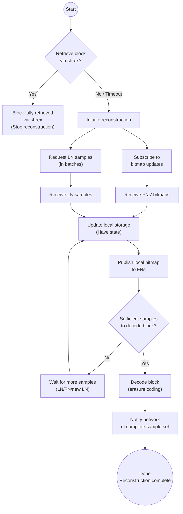

---

## Abstract

This document proposes a new block reconstruction protocol to address key bottlenecks in the current implementation, particularly those related to duplicate requests and suboptimal bandwidth usage. By adopting a structured approach to data retrieval, the protocol emphasizes network resource efficiency and scalability.

## Motivation

The current block reconstruction protocol exhibits the following limitations:

1. Frequent duplicate requests, leading to network inefficiency
2. Suboptimal bandwidth usage
3. Limited scalability as block sizes and node counts increase

To overcome these challenges, this proposal introduces:

- Structured bitmap sharing
- Optimized proof packaging
- Efficient state management
- Robust failure handling

In doing so, the new protocol aims to:

- Minimize duplicate data requests
- Optimize bandwidth usage through smart data packaging
- Scale effectively across a range of block sizes and node counts
- Maintain stability under varying network conditions

### Engineering Time

The initial implementation targets minimal engineering effort. Optimizations marked as optional can be added in subsequent iterations, guided by observed network performance metrics.

---

## Specification

### General Performance Requirements

1. **Base Scenario Support**
   - 32 MB block size
   - Minimum required Light Nodes for 32 MB blocks
   - Network of 50+ Full Nodes

2. **Performance Metrics (in order of priority)**
   - System stability
   - Reconstruction throughput (blocks/second)
   - Per-block reconstruction time

3. **Scalability Dimensions**
   - Block size
   - Node count

---

## Reconstruction Overview

If a Full Node (FN) cannot retrieve a block via the shrex protocol, it initiates a reconstruction process. During this process, the FN gathers samples from connected Light Nodes (LNs) and Full Nodes, while also relaying samples to other FNs. The following steps outline the reconstruction flow:

1. **Get samples from LNs.**
   - Use the `GetSamples` protocol to retrieve samples from connected Light Nodes.
   - To avoid congestion, request samples in batches (e.g., up to 100 Light Nodes at a time).

2. **Get samples from FNs and relay samples to other FNs.**
   - Use the `SubscribeBitmap` protocol to receive bitmap updates from connected Full Nodes.
   - If the returned bitmap indicates samples not present locally, request them from the Full Node via `GetSamples`.
   - Allow other Full Nodes to subscribe to the bitmap, sending them periodic updates.
   - Serve collected samples to other Full Nodes when requested.

---

## Sampling Protocol

The current implementation of the sampling protocol relies on [bitswap](https://github.com/ipfs/go-bitswap) to request samples from Full (or Bridge) nodes. Under normal assumptions—when data is reliably available—bitswap works well. It provides a robust system for fetching data by content identifier (CID), along with advanced features for load distribution and prioritization.

However, bitswap has a critical limitation: **it lacks content discovery**. When content discovery is absent, a node must attempt requests with each peer until it finds one that actually has the data. This becomes especially problematic during reconstruction. In that scenario, only the attacker nodes hold the block data initially; honest Full Nodes do not. As a result:

1. Light Nodes (LNs) repeatedly attempt to fetch samples from honest Full Nodes, which cannot serve these requests because they don’t yet have the block data.
2. This generates excessive “spam” requests directed at nodes that are in the process of reconstructing the block, ultimately degrading performance.

**Replace bitswap with shrex-based Samples protocol.**

To resolve this issue, the protocol must incorporate a more effective content discovery mechanism. Fortunately, the **shrex-based Samples protocol**, already required for reconstruction, can also serve LN sampling needs. By adopting this unified solution, we can eventually phase out bitswap for **all** data retrieval tasks, removing it as a dependency and streamlining the system’s architecture.

---

## Reconstruction Flow

Below is a step-by-step illustration of the reconstruction flow, with accompanying diagrams.

1. **Initial network topology**
   1. An attacker node joins the network but connects only to Light Nodes.
   2. Full Nodes are interconnected and also connect to Light Nodes.
   3. Light Node #5 (LN5) is isolated from the attacker node.

   

2. **Headers propagation and LN sample request**
   1. The attacker attempts to deceive the network by sending a block header, prompting LNs to request samples.
   2. Light Nodes propagate the block header further to the network—first to FNs, which then relay it to LN5.

   

3. **Start of reconstruction**
   1. FNs attempt to download the block via shrex but fail due to a timeout, triggering the reconstruction process.
   2. FNs begin collecting samples from connected LNs.
   3. FNs subscribe to bitmap updates from connected FNs.

   

4. **Bitmap notification**
   - FNs collect samples from LNs.
   - FNs send bitmap updates to connected FNs.

   

5. **Sample exchange**
   - FNs collect samples that are available in the network but do not request those already held locally.

   

6. **Sample relaying and subsequent exchange rounds**
   - After receiving samples in the first round, FNs continue to send bitmap updates of newly collected samples to other FNs.
   - FN2 acquires some samples not available on FN1 or FN3, which then request these samples from FN2.
   - Additional exchange rounds may occur if needed.

   

7. **New LN joins the network**
   - Not enough samples are available for each FN to reconstruct the block.
   - A new LN joins with a fresh set of samples and starts sending them to FN2.

   

8. **Reconstruction is possible now**
   - FN2 can now reconstruct the block via erasure decoding.

   

9. **Completed reconstruction notification**
   - FN2 notifies other FNs that it has finished reconstruction and now holds all samples.
   - FN1 and FN3 can request any missing samples from FN2. For instance, they might request the sample at (X:1, Y:0).

   

10. **Reconstruction complete on all FNs**
- All FNs successfully reconstruct the block.

   

---

### Protocol Diagrams

Below is an outline of the proposed protocols. Full flow diagrams appear at the end of this document.

```
1. Bitmap Subscription 
   Client (FN)                            Server (FN)
      |---- Subscribe to bitmap -------------->|
      |<---- Initial bitmap -------------------|
      |<---- Updates  -------------------------|
      |<---- End updates ----------------------|

2. GetSamples
   Client (FN)                     Server (FN/LN)
      |---- Request(bitmap) ----------->|
      |<---- [Samples + Proof] parts ---|
```

---

### No Bitmap Subscription From Light Nodes: Why?

Subscribing to bitmaps from Light Nodes would allow more precise deduplication of requested samples, but it also introduces additional complexity and round-trip overhead. Since each Light Node holds relatively few samples, the probability of overlap is low. Instead, the Full Node can send an inverse “have” bitmap in its request to indicate which samples are still needed.

**Tradeoff**:

- **Pros**
   - Fewer round trips between LN and FN
   - Light Nodes do not need to maintain subscriptions
   - Light Nodes do not need to implement the bitmap subscription protocol

- **Cons**
   - Some samples may be requested multiple times

A Monte Carlo simulation was conducted to quantify overhead from potential duplicate requests, summarized below:

| Block Size | % Overhead (LN = 256) | % Overhead (LN = 128) |
|------------|-----------------------|-----------------------|
| 16         | 21                   | 24                    |
| 32         | 22                   | 17                    |
| 64         | 9                    | 4.7                   |
| 128        | 2.4                  | 1.12                  |
| 256        | 0.57                 | 0.28                  |
| 512        | 0.14                 | 0.07                  |

The data indicates that overhead is negligible for larger block sizes. To keep the protocol simpler, **SubscribeBitmap** is not used for Light Nodes; instead, FNs request samples directly.

---

## Core Components

### List of Core Components

1. Decision engine
2. State management
3. Bitmap subscription protocol
4. Samples retrieval protocol
5. Samples store (new file format)
6. Peer identification
7. Light node sampling protocol

---

### 1. Reconstruction Process

A global, per-block coordinator should oversee the data request process.

1. **Request initiation** can follow various strategies:
   - Immediate requests for all missing samples upon receiving a bitmap
   - (Optional) Delayed requests for bandwidth optimization:
      - Wait for X% of peer responses
      - Wait for a fixed time delay
      - Wait for complete EDS availability
      - Wait for a pre-confirmation threshold
      - Any combination of the above

2. **Select which samples to request**, and from which peers.

For the first iteration, keep the decision engine simple to validate other components. Primary goals:

- Eliminate requests for duplicate data
- Avoid requesting data already derivable from existing information

#### First Implementation Steps

1. **Subscribe** to bitmap updates from Full Nodes.
2. **Handle bitmap updates**: If a sample is neither stored locally nor already being fetched, request it from a peer.
   - Keep an in-progress list to avoid duplicate requests.
3. **Handle sample responses**:
   - Verify proofs. Penalize peers if proofs are invalid.
   - Store samples in the local store and update the “Have” state.
   - Remove those samples from the in-progress list.
   - Clean up coordinate metadata to free memory.
4. **On reconstruction completion**, clear the local state and end the process.

#### Potential Optimizations

- Skip encoding derivable data by requesting complete rows/columns from peers.
- Reduce proof sizes with range requests.
- Use subtree proofs if adjacent subroots are already stored.
- Distribute requests in parallel to balance load.
- Prefer peers with lower latency.

---

### 2. State Management

**Remote State** holds information about which peers have specific samples. If a peer stores a complete row or column, it is tracked separately:

```go
type RemoteState struct {
    coords [][]peers    // Peer lists by coordinates
    rows []peers        // Peers with full row data
    cols []peers        // Peers with full column data
    available bitmap    // Available samples bitmap
}

// Basic peer list structure. Can be extended to implement peer scoring.
type peers []peer.ID
```

**Query Interface**:

```go
// Returns peers that hold the given samples.
// Required for the first implementation.
func (s *RemoteState) GetPeersWithSample(coords []Coord) []peer.ID

// Returns peers that hold a particular row or column.
// Used for bandwidth optimization.
func (s *RemoteState) GetPeersWithAxis(axisIdx int, axisType AxisType) []peer.ID

// Returns a bitmap representing all samples available among connected peers.
func (s *RemoteState) Available() bitmap
```

**Progress State** tracks ongoing fetches and locally stored samples:

```go
// Tracks samples currently being fetched, preventing duplicates.
func (s *ProgressState) InProgress() bitmap

// Tracks samples already stored locally,
// used to inform peers about local availability.
func (s *ProgressState) Have() bitmap
```

---

### 3. Bitmap Protocol

Full Nodes use this protocol to efficiently signal available samples. It uses bitmaps to indicate which samples the server holds, enabling clients to avoid requesting duplicates.

#### Client

- Sends a request to subscribe to bitmap updates.
- If the subscription closes or is interrupted, re-subscribe.

**Request**:

```protobuf
message SubscribeBitmapRequest {
    uint64 height = 1;
}
```

#### Server

- Implements a one-way stream for sending bitmap updates.
- Sends the initial bitmap immediately.
- Sends further updates periodically (e.g., every 5 seconds) or sooner when there are significant changes.
- Sends a final update indicating subscription completion when no more updates are expected.

**Response**:

```protobuf
message BitmapUpdate {
    Bitmap bitmap = 1;
    bool completed = 2;
}
```

**Roaring Bitmaps** are used for efficient operations and storage:

1. **Efficient Operations**
   - Fast logical operations (AND, OR, XOR)
   - Handles both sparse and dense data well
   - Memory-efficient

2. **Implementation Benefits**
   - Common library support in Go, Rust, C++, Java
   - Optimized serialization
   - Rank/select operations for advanced queries

3. **Performance Characteristics**
   - O(1) complexity for most operations
   - Compressed storage format
   - Efficient memory usage

The protocol uses a 32-bit encoding for broad compatibility.
Available implementations:
- Go: [roaring](https://github.com/RoaringBitmap/roaring)
- Rust: [roaring-rs](https://github.com/RoaringBitmap/roaring-rs)
- C++: [CRoaring](https://github.com/RoaringBitmap/CRoaring)
- Java: [RoaringBitmap](https://github.com/RoaringBitmap/RoaringBitmap)

---

### 4. Samples Request Protocol

Data retrieval uses the **shrex** protocol. The client sends a bitmap specifying needed samples:

```protobuf
message SampleRequest {
    uint64 height = 1;
    Bitmap bitmap = 2;
}
```

#### Client

- Validates that returned samples match the requested bitmap.
- Verifies proofs and penalizes peers for invalid proofs.

#### Response

The server returns the requested samples and their proofs (as specified in the shwap CIP). If it lacks certain samples, it sends a partial response.

```protobuf
message SamplesResponse {
  repeated Sample samples = 1;
}
```

#### Possible Optimizations

- Combine adjacent samples that share proofs into a single response.
- If both a row and a column are requested, their intersection share should be sent only once.

---

### 5. Storage Backend

A new storage format is required for efficient sample proof handling. Initially, it will be used only for reconstruction, but could be extended for Light Nodes in the future.

1. **Core Requirements**
   - Store samples with proofs
   - Purge proofs upon successful reconstruction
   - Provide a bitmap query interface
   - Support row/column data retrieval
   - Comply with the accessor interface

2. **Optional Optimizations**
   - Integrate with a bitmap subscription mechanism
   - Efficient proof generation to reduce overhead

---

### 6. Peer Identification

Peer identification ensures Full Nodes can distinguish Full Nodes from Light Nodes, as each follows different protocols:

- Full Nodes: `SubscribeBitmap`, `GetSamples`
- Light Nodes: `GetSamples`

Peer information can be inferred from the host (e.g., user agent or a `libp2p.Identity` protocol).

---

### 7. Light node sampling protocol

A new protocol for Light Nodes to acquire block samples directly from Full Nodes, **based on the Samples Retrieval Protocol (item #4)**. By adopting this approach, we can phase out bitswap and unify the mechanisms used for both normal sampling and reconstruction. Key advantages include:

---

## False Positive Overhead

In certain rare scenarios, a Full Node (FN) might fail to obtain a block via shrex due to transient networking issues or software bugs. As a result, it may erroneously enter the reconstruction process (a “false positive”). This false alarm creates unnecessary overhead on the network, as the node begins sending sample requests to Light Nodes and setting up bitmap subscriptions. Although the likelihood of such events is relatively low, it is still worth considering potential mitigation strategies:

### Potential Mitigation Strategies

1. **Lower the Chance of a False Positive**
   - **Track Multiple `NOT_HAVE` Responses**  
     If an FN sees repeated `NOT_HAVE` responses over an extended period, it becomes more likely that the block truly isn’t available on the network. This reduces the chance of prematurely triggering reconstruction.
   - **Extend Shrex Timeouts with Caution**  
     If repeated attempts to fetch the block fail, the FN could increase its shrex timeouts while gathering enough evidence that the block is not available. However, this approach must guard against attackers who might falsely claim to have the block but never serve it (i.e., withholding attacks).

2. **Lower the Impact of a False Positive**
   - **Staged Reconstruction**  
     Allow the node to run shrex in the background while performing reconstruction in phases. Initially, it might only subscribe to bitmaps lightly, ramping up resource usage gradually if it still can’t locate the block. This approach reduces unnecessary load on the network if the trigger was false, but it may also delay reconstruction if the block genuinely is unavailable.

---

All of these methods are optional considerations. **Ensuring robust reconstruction remains a higher priority**; therefore, these false positive mitigations can be evaluated and implemented at a later time if deemed necessary.

--- 

## Backwards Compatibility

A coordinated network upgrade may be required as this protocol evolves. The implementation should support:

1. **Version negotiation**
2. **Transition period support**
3. **Fallback mechanisms**

---

## Full Reconstruction Process Diagram
<div style="transform: scale(0.50); transform-origin: top left;">


</div> 
