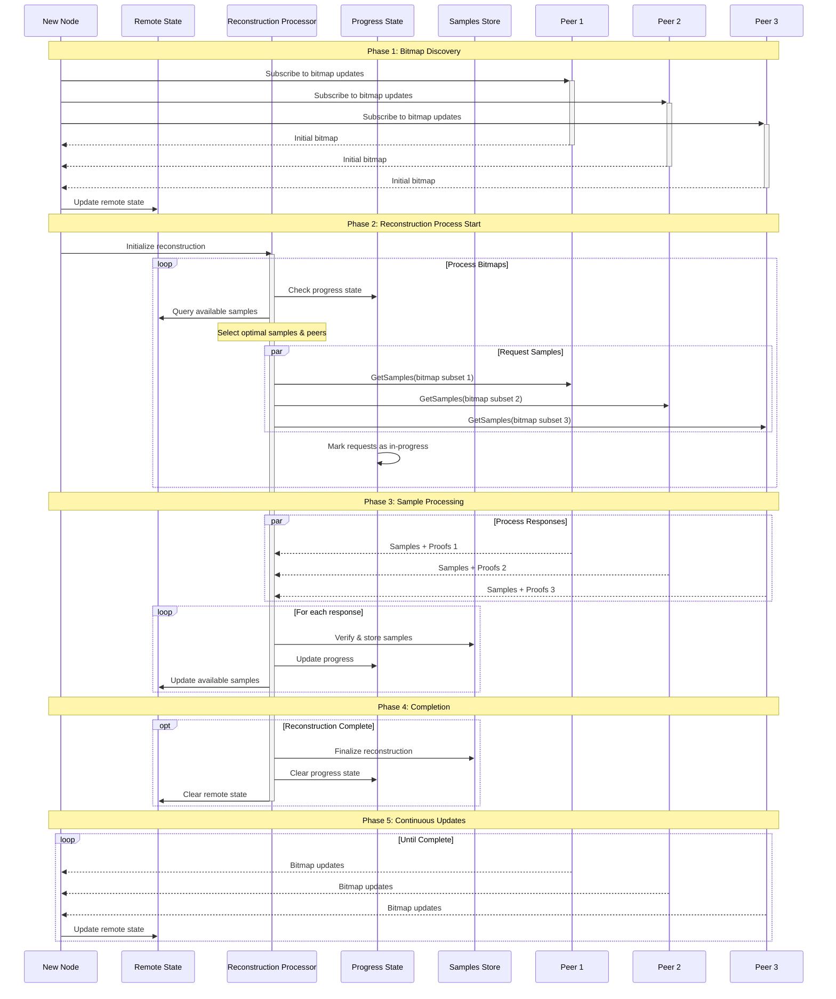

## Abstract

This document proposes a new block reconstruction protocol that addresses key bottlenecks in the current implementation, particularly focusing on reducing duplicate requests and optimizing bandwidth usage. The protocol provides a structured approach to data retrieval with a clear emphasis on network resource efficiency and scalability.

## Motivation

The current block reconstruction protocol faces several limitations:

1. Frequent duplicate requests, resulting in network inefficiency
2. Suboptimal bandwidth utilization
3. Limited scalability as block sizes and node counts increase

Key improvements include:

- Structured bitmap sharing
- Optimized proof packaging
- Efficient state management
- Robust failure handling

This proposal aims to implement a more efficient reconstruction protocol that:

- Minimizes duplicate data requests
- Optimizes bandwidth usage through smart data packaging
- Scales effectively across multiple dimensions
- Remains stable under varying network conditions

### Engineering Time

The initial draft targets minimal engineering effort for the first implementation iteration. Optimizations marked as optional can be added later based on observed network performance metrics.

## Specification

### General Performance Requirements

1. **Base Scenario Support**
    - 32 MB block size
    - Minimum required Light Nodes for 32 MB blocks
    - Network of 50+ Full Nodes

2. **Performance Metrics (in order of priority)**
    - System stability
    - Reconstruction throughput (blocks/second)
    - Per-block reconstruction time

3. **Scalability Dimensions**
    - Block size scaling
    - Node count scaling

## Reconstruction Flow

If a Full Node cannot retrieve a block via the shrex protocol, it initiates the reconstruction process. During this process, the Full Node collects samples from both connected Light Nodes and Full Nodes, and enables efficient sample relaying to other Full Nodes. The following steps outline the reconstruction flow:

1. **Get samples from LNs.**
    - Use the GetSamples protocol to retrieve samples from connected Light Nodes.
    - To avoid congestion, request samples in batches (e.g., up to 100 Light Nodes at a time).

2. **Subscribe to bitmap updates.**
    - Use the SubscribeBitmap protocol to receive bitmap updates from connected Full Nodes.
    - If the returned bitmap contains samples not present locally, request them from the Full Node using GetSamples.

### No Bitmap Subscription From Light Nodes: Why?

Subscribing to bitmaps from Light Nodes would allow the reconstructing node to fully control deduplication of requested samples, preventing simultaneous duplicate requests. However, it also introduces extra complexity and round-trip overhead. Since each Light Node holds only a few samples from any given block and the probability of overlap is low, a simpler approach is to skip bitmap subscriptions for LNs. Instead, the Full Node can send an inverse “have” bitmap in the request to indicate which samples it still needs.

**Tradeoff:**

- **Pros**
    - No additional round trips between LN and FN
    - Light Nodes do not need to maintain subscriptions
    - Light Nodes do not need to implement the bitmap subscription protocol

- **Cons**
    - Some samples may be requested multiple times

To quantify the overhead of duplicate requests, a Monte Carlo simulation was conducted. Below is a summary of the results:

| Block Size | % Overhead (LN = 256) | % Overhead (LN = 128) |
|------------|-----------------------|-----------------------|
| 16         | 21                   | 24                    |
| 32         | 22                   | 17                    |
| 64         | 9                    | 4.7                   |
| 128        | 2.4                  | 1.12                  |
| 256        | 0.57                 | 0.28                  |
| 512        | 0.14                 | 0.07                  |

These results show that overhead is negligible for larger block sizes. Therefore, to keep the protocol simpler, we will not use SubscribeBitmap for Light Nodes and will request samples directly.

### Protocol Diagrams

Below is an outline of the proposed protocols. Detailed specifications are provided in subsequent sections. Full flow diagrams are at the end of this document.

```
1. Bitmap Subscription 
   Client (FN)                            Server (FN)
      |---- Subscribe to bitmap -------------->|
      |<---- Initial bitmap -------------------|
      |<---- Updates  -------------------------|
      |<---- End updates ----------------------|

2. GetSamples
   Client (FN)                     Server (FN/LN)
      |---- Request(bitmap) ----------->|
      |<---- [Samples + Proof] parts ---|
```

## Core Components

### List of Core Components

1. Decision engine
2. State management
3. Bitmap subscription protocol
4. Samples retrieval protocol
5. Samples store (new file format)
6. Peer identification

### 1. Reconstruction Process

A global, per-block coordinator should manage the data request process.

1. **Request initiation** can follow multiple strategies:
    - Immediate request for all missing samples upon receiving a bitmap
    - (Optional) Delayed request start for bandwidth optimization:
        - Wait for X% of peer responses
        - Wait for a fixed time delay
        - Wait for complete EDS availability
        - Wait for a pre-confirmation threshold
        - Combination of any conditions

2. **Select which samples to request** and from which peers.

For the first iteration, keep the decision engine simple to test other components and validate the overall concept. The main goals are:

- Eliminate requests for duplicate data
- Avoid requesting data that can be derived from existing data

#### First Implementation

1. **Subscribe** to bitmap updates from Full Nodes.
2. **Handle bitmap updates**: if a sample is neither stored locally nor already in-progress, request it from a peer.
    - Maintain an in-progress list to avoid duplicate requests.
3. **Handle sample responses**:
    - Verify proofs. Penalize peers if proofs are invalid.
    - Store samples in the local store and update the local “Have” state.
    - Remove the samples from the in-progress bitmap.
    - Clean up coordinate information from remote state to free memory.
4. **When reconstruction completes**, clear local state and terminate the reconstruction process.

#### Potential Optimizations

- Skip encoding derivable data by requesting from peers that hold complete rows/columns.
- Optimize proof sizes via range requests.
- Use subtree proofs if adjacent subroots are already stored.
- Distribute requests in parallel to minimize load on individual peers.
- Prefer peers with lower latency.

### 2. State Management

**Remote State** stores information about which peers hold samples for specific coordinates. If a peer has complete row or column data, it is tracked separately.

```go
type RemoteState struct {
    coords [][]peers    // Peer lists by coordinates
    rows []peers        // Peers with full row data
    cols []peers        // Peers with full column data
    available bitmap    // Available samples bitmap
}

// Basic peer list structure. May be replaced to implement peer scoring.
type peers []peer.ID
```

**Query Interface**

```go
func (s *RemoteState) GetPeersWithSample(coords []Coord) []peer.ID
func (s *RemoteState) GetPeersWithAxis(axisIdx int, axisType AxisType) []peer.ID
func (s *RemoteState) Available() bitmap
```

**Progress state** tracks ongoing fetch sessions and locally stored samples:

```go
// Tracks ongoing fetch sessions to prevent duplicate requests
func (s *ProgressState) InProgress() bitmap

// Tracks samples already stored locally; used to inform peers about local availability
func (s *ProgressState) Have() bitmap
```

### 3. Bitmap Protocol

Full Nodes implement this protocol to efficiently retransmit samples. It uses bitmaps to indicate which samples the server holds, enabling clients to avoid requesting duplicates.

#### Client

- The client sends a request to subscribe to bitmap updates.
- If the subscription is closed or interrupted, the client should re-subscribe.

**Request**

```protobuf
message SubscribeBitmapRequest {
    uint64 height = 1;
}
```

#### Server

- Implements a one-way stream for bitmap updates.
- Sends the first bitmap update immediately.
- Sends subsequent updates every 5 seconds (or more frequently if significant changes occur).
- Sends an end-of-subscription flag when no more updates are expected.

**Response**

```protobuf
message BitmapUpdate {
    Bitmap bitmap = 1;
    bool completed = 2;
}
```

The protocol uses **Roaring Bitmaps** for efficient operations and storage:

1. **Efficient Operations**
    - Fast logical operations (AND, OR, XOR)
    - Optimized for both sparse and dense data
    - Memory-efficient storage

2. **Implementation Benefits**
    - Native support for common bitmap operations
    - Optimized serialization
    - Efficient iteration over set bits
    - Rank/select operations available

3. **Performance Characteristics**
    - O(1) complexity for most operations
    - Compressed storage format
    - Efficient memory usage

The protocol uses 32-bit encoding for broad compatibility. Libraries include:

- Go: [roaring](https://github.com/RoaringBitmap/roaring)
- Rust: [roaring-rs](https://github.com/RoaringBitmap/roaring-rs)
- C++: [CRoaring](https://github.com/RoaringBitmap/CRoaring)
- Java: [RoaringBitmap](https://github.com/RoaringBitmap/RoaringBitmap)

### 4. Samples Request Protocol

Data retrieval uses the **shrex** protocol. The client sends a bitmap indicating which samples it needs.

```protobuf
message SampleRequest {
    uint64 height = 1;
    Bitmap bitmap = 2;
}
```

#### Client

- Validates that returned samples match the requested bitmap.
- Verifies proofs and penalizes peers that provide invalid proofs.

#### Response

- The server responds with samples and proofs, as defined in shwap CIP.
- The server sends all available samples in a single response. If it lacks certain samples, it sends a partial response.

```protobuf
message SamplesResponse {
  repeated Sample samples = 1;
}
```

#### Optimizations

- Adjacent samples can share common proofs. The server can package shares with common proofs in a single response.
- If both a row and a column are requested, their intersection share need only be sent once.

### 5. Storage Backend

A new storage format is required for efficient sample proof storage. It will first be used for the ongoing reconstruction process but can later be adapted for Light Node storage.

1. **Core Requirements**
    - Sample storage with proofs
    - Ability to purge proofs on successful reconstruction
    - Bitmap query support
    - Row/column access implementation
    - Must comply with the accessor interface

2. **Optional Optimizations**
    - Bitmap subscription support with callbacks
    - Efficient proof generation to reduce proof overhead

### 6. Peer Identification

Peer identification enables Full Nodes (FNs) to distinguish Full Nodes from Light Nodes (LNs) because each is communicated with via different protocols:

- Full Nodes: SubscribeBitmap, GetSamples
- Light Nodes: GetSamples

Peer information can be obtained through the host (e.g., user agent or `libp2p.Identity` protocol).

## Backwards Compatibility

During this protocol’s lifecycle, it may require a coordinated network upgrade. The implementation should support:

1. **Version negotiation**
2. **Transition period support**
3. **Fallback mechanisms**

## Full Reconstruction Process Diagram

