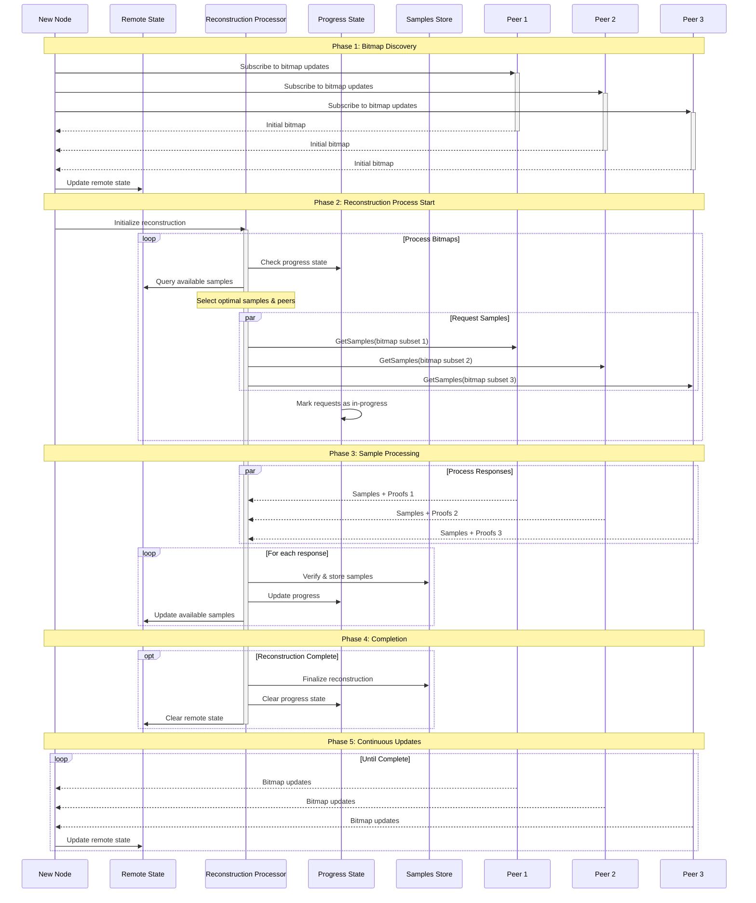

## Abstract

This document proposes a new block reconstruction protocol that addresses key bottlenecks in the current implementation, specifically targeting duplicate request reduction and bandwidth optimization. The protocol introduces a structured approach to data retrieval with an explicit focus on network resource efficiency and scalability.

## Motivation

The current block reconstruction protocol faces several limitations:
1. High frequency of duplicate requests leading to network inefficiency
2. Suboptimal bandwidth utilization
3. Limited scalability with increasing block sizes and node count

Key improvements include:
- Structured bitmap sharing
- Optimized proof packaging
- Efficient state management
- Robust failure handling

This proposal aims to implement an efficient reconstruction protocol that:
- Minimizes duplicate data requests
- Optimizes bandwidth usage through smart data packaging
- Supports network scaling across multiple dimensions
- Maintains stability under varying network conditions

#### Engineering Time

The initial draft aims to be optimized in terms of engineering efforts required for the first iteration of implementation. Optimizations marked as optional can be implemented in subsequent updates based on network performance metrics.

## Specification

### General Performance Requirements

1. Base Scenario Support:
   - 32MB block size
   - Minimum required light nodes for 32MB blocks
   - Network of 50+ full nodes

2. Performance Metrics (in order of priority):
   - System stability
   - Reconstruction throughput (blocks/second)
   - Per-block reconstruction time

3. Scalability Dimensions:
   - Block size scaling
   - Node count scaling

## Reconstruction Flow 

Once the Full node identifies it cannot fetch the block using shrex protocol, it will start the reconstruction process. 
Full node would need to collect samples from connected Light nodes and Full nodes. It should also allow efficient relay of samples to other Full nodes. In order to
achieve this, it will need to implement the following reconstruction flow:
1. **Get samples from LN**. Start process of collecting samples from connected Light nodes
   1. Use GetSamples protocol to get samples from connected Light nodes
   2. To prevent congestion of returned samples, use batching. Request samples from connected Light nodes in batches with fixed size (e.g. 100 LN at a time). 
2. **Subscribe to bitmap updates**. Subscribe to bitmap updates from connected Full nodes
   1. Use SubscribeBitmap protocol to subscribe to bitmap updates from connected Full nodes
   2. If returned bitmap has samples that are not present in the node store, request samples from Full node using GetSamples protocol

#### No bitmap subscription from Light nodes. Why?
Bitmap subscription from Light nodes would allow reconstructing node (subscriber of bitmaps) to be fully in control
of deduplication of requested samples. It will allow to make decision on what samples to request and to not have any duplicates being simultaniously requested However, it would also introduce additional complexity and overhead from round trips.
The fact, that each LN has only few samples from  the same block and the probability of overlap is low, alternative solution can be to not use bitmaps and request samples without prior knowledge of what samples LN has. FN would send inverse have bitmap in request indicating what it want. 
So the tradeoff would be
- Pros:
  - No additional round trips between LN and FN
  - LN don't need to maintain subscriptions from FN
  - LN does not need implement bitmap subscription protocol
- Cons:
  - Some samples might be requested multiple times

To determine which approach to use, we need to know what is duplicates overhead. Monte carlo simulation can be used to estimate the number of duplicates.
Here is summary of the results:

| Block Size | % Overhead (ln = 256) | % Overhead (ln = 128) |
|------------|-----------------------|-----------------------|
| 16         | 21     | 24                    |
| 32         | 22    | 17                    |
| 64         | 9     | 4.7                   |
| 128        | 2.4    | 1.12                  |
| 256        | 0.57    | 0.28                  |
| 512        | 0.14    | 0.07                  |

Results show, that overhead is negligible on large block sizes. Given that overhead is negligible on larger blocks, we can use simpler approach of not using SubscribeBitmap protocol for LN and requesting samples without prior knowledge of what samples LN has.

#### Protocol diagrams
Diagram below outlines protocols proposed above. The detailed specifications of protocol are provided in the subsequent sections. Full flow diagrams are available in the end of this document.
```
1. Bitmap Subscription 
   Client (FN)                            Server (FN)
      |---- Subscribe to bitmap -------------->|
      |<---- Initial bitmap -------------------|
      |<---- Updates  -------------------------|
      |<---- End updates(full eds/max samples)-|

2. GetSamples
   Client (FN)                     Server (FN/LN)
      |---- Request(bitmap) ----------->|
      |<---- [Samples + Proof] parts ---|
```


## Core Components

#### List of Core Components

1. Decision engine 
2. State management 
3. Bitmap subscription protocol
4. Samples retrieval protocol 
5. Samples store (new file format)
6. Peer identification

### 1. Reconstruction Process
There should be a global per-block coordinator process that will be responsible for managing the data request process.

1. Request Initiation may have multiple strategies:
   - Immediate request of all missing samples upon bitmap receipt
   - (Optional): Delayed start for bandwidth optimization
      - Wait for X% peer responses
      - Fixed time delay
      - Complete EDS availability
      - Pre-confirmation threshold
      - Combination of conditions

2. Select which samples to request and from which peers

The first iteration of the decision engine can be implemented as simply as possible to allow easier testing of other components and prove the concept. The base properties should be:
- Eliminate requests for duplicate data
- Do not request data that can be derived from other data. Request just enough data for successful reconstruction

#### First Implementation:
1. Subscribe to bitmap updates from FN
2. Handle bitmap updates. If any sample is not stored and not in progress, request it from a peer
   - Keep track of in-progress requests in local state
3. Handle sample responses
   - Verify proofs. If a proof is invalid, the peer should be penalized
   - Store samples in local store and update local Have state
   - Remove samples from in-progress bitmap
   - Clean up information about sample coordinates from remote state to free up memory
4. If reconstruction is complete, clean up local state and shut down the reconstruction process

#### Potential Optimizations
- Skip encoded derivable data in response by requesting from peers that have all shares from the same rows/columns
- Optimize proof sizes through range requests
- Optimize proof sizes through subtree proofs if adjacent subroots are stored
- Parallel request distribution to reduce network load on single peers
- Request from peers with smaller latency

### 2. State Management
1. Remote State will store information about peers that have samples for given coordinates. If it has full rows/columns, it will be stored in a separate list.
```go
type RemoteState struct {
    coords [][]peers    // Peer lists by coordinates
    rows []peers        // Peers with full row data
    cols []peers        // Peers with full column data
    available bitmap    // Available samples bitmap
}

// Basic peer list structure. Structure might be replaced later to implement better 
// peer scoring mechanics 
type peers []peer.ID
```

Query Interface

Remote state:
```go
func (s *RemoteState) GetPeersWithSample(coords []Coord) []peer.ID
func (s *RemoteState) GetPeersWithAxis(axisIdx int, axisType AxisType) []peer.ID
func (s *RemoteState) Available() bitmap
```

Progress state:
```go
// Tracks ongoing fetch sessions to prevent requesting duplicates
func (s *ProgressState) InProgress() bitmap
// Tracks samples that are already stored locally to notify peers about it
func (s *ProgressState) Have() bitmap
```

### 3. Bitmap Protocol
Bitmap protocol should be implemented by Full Nodes to allow efficient retranslation of samples. It uses bitmaps to sent representation the state of samples stored on Server to allow client to not request samples that it already has.

### Client
- Client should send a request to subscribe to bitmap updates
- If the subscription gets closed or interrupted, client should re-subscribe

#### Request
```protobuf
message SubscribeBitmapRequest {
    uint64 height = 1;
}
```

### Server
- Server implements a one-way stream for bitmap updates
- Server should send the first bitmap update immediately
- Next updates should be sent every 5 seconds
   - (Optional): Server can send updates more frequently if there is a significant change in the bitmap
- Server should send an end-of-subscription flag when no more updates are expected
   - Full nodes: stream until EDS is available on server

#### Response
```
message BitmapUpdate {
    Bitmap bitmap = 1;
    bool completed = 2;
}
```

The protocol utilizes Roaring Bitmaps for efficient bitmap operations and storage. Roaring Bitmaps provide several advantages for the reconstruction protocol:

1. Efficient Operations
   - Fast logical operations (AND, OR, XOR)
   - Optimized for sparse and dense data
   - Memory-efficient storage

2. Implementation Benefits
   - Native support for common bitmap operations
   - Optimized serialization
   - Efficient iteration over set bits
   - Support for rank/select operations

3. Performance Characteristics
   - O(1) for most common operations
   - Compressed storage format
   - Efficient memory utilization
   - Fast bitmap comparisons

The protocol will use 32-bit encoding for bitmaps to have greater multi-language support. Implementation can use one of the encoding-compatible libraries:
- Go: https://github.com/RoaringBitmap/roaring
- Rust: https://github.com/RoaringBitmap/roaring-rs
- C++: https://github.com/RoaringBitmap/CRoaring
- Java: https://github.com/RoaringBitmap/RoaringBitmap

### 4. Samples Request Protocol

#### Request

- Use shrex for data retrieval
- Send bitmap for data request. Bitmap should contain coordinates for requested samples
```protobuf 
message SampleRequest {
  height uint64 = 1;
  Bitmap bitmap = 2;
}
```

#### Client
- Client should validate returned samples matches requested bitmap.
- Client should verify proofs. If a proof is invalid, the peer should be penalized

#### Response
- Server should respond with samples with proofs defined in shwap CIP [past link].
- Server should send samples in a single response.
- If server does not have all requested samples, it should send a partial response with available samples.
```protobuf
message SamplesResponse {
  repeated Sample samples = 1;
}
```

#### Optimizations:
- Adjacent samples can have common proofs. Server would need to send shares with common proof in a single response.
  Each part contains packed samples in Range format
- If both Row and column are requested, intersection share can be sent once

### 5. Storage Backend
A new storage format needs to be implemented for efficient storage of sample proofs. The format will be
initially used for storing ongoing reconstruction process and later can be used for light node storage.

1. Core Requirements
- Sample storage with proofs
- Allow purge of proofs on successful reconstruction
- Bitmap query support
- Row/column access implementation
- Accessor interface compliance

2. Optional Optimizations
- Bitmap subscription support for callbacks
- Efficient proof generation to reduce proof size overhead

### 6. Peer Identification

Peer identification is required by FN to distinguish Full Nodes from Light Nodes, because they will be communicated with different protocols:
- Full Nodes: SubscribeBitmap, GetSamples
- Light Nodes: GetSamples

Information about the peer can be obtained from the host using user agent or by `libp2p.Identity` protocol. 


## Backwards Compatibility

In the lifespan of the protocol, it may require a coordinated network upgrade. Implementation should allow for:
1. Version negotiation
2. Transition period support
3. Fallback mechanisms


## Full reconstruction process diagram
