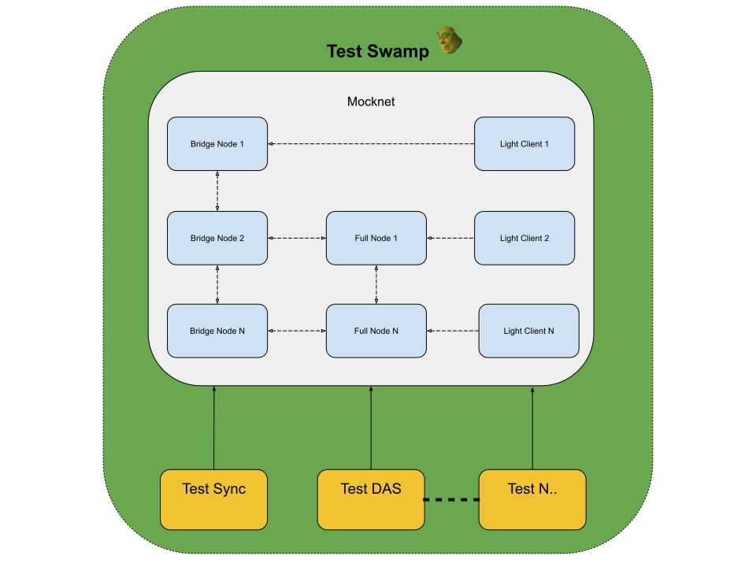

# Swamp: In-Memory Test Tool

Swamp is our integration testing tool that creates an environment for deploying `celestia-node` and testing instances against each other.
While the swamp takes care of setting up networking and initial configuration of node types, the user can focus on tailoring test scenarios.

## Usage

### Creating a swamp

Calling `NewSwamp` will return you a new constructed swamp with the mocknet. That function looks like this:

```go
swamp := NewSwamp(t)
```

The first parameter of the swarm constructor is the `testing.T`

### Constructing Celestia nodes

You can construct any Celestia `bridge/full/light` nodes using swamp and be rest assured that they will be linked between each other.
<i>Note: Linking nodes does not mean that you have connected them. Linking only enables further connection between nodes.
Think of linking as a fibre cable between 2 PCs. Connecting is the actual process from the OS level in communicating between them.</i>

```go
// you can add any options during initialization in the signature
bridge := swamp.NewBridgeNode()
```

### Connecting Celestia nodes

In the swamp instance, you can find the `Network` field that is needed to connect Celestia nodes to each other.

For example, you will need to know the host of the first Celestia node to be able to connect to it from the second one:

```go
addrs, err := peer.AddrInfoToP2pAddrs(host.InfoFromHost(sw.Network.Host(bridge.Host.ID())))
require.NoError(t, err)
light := sw.NewLightClient(node.WithTrustedPeer(addrs[0].String()))
```

## Conceptual overview

Each of the test scenario requires flexibility in network topology.
The user can define the necessary amount of each type of node and be able to control each of them.
The below diagram provides more visual clarity of what can be done

