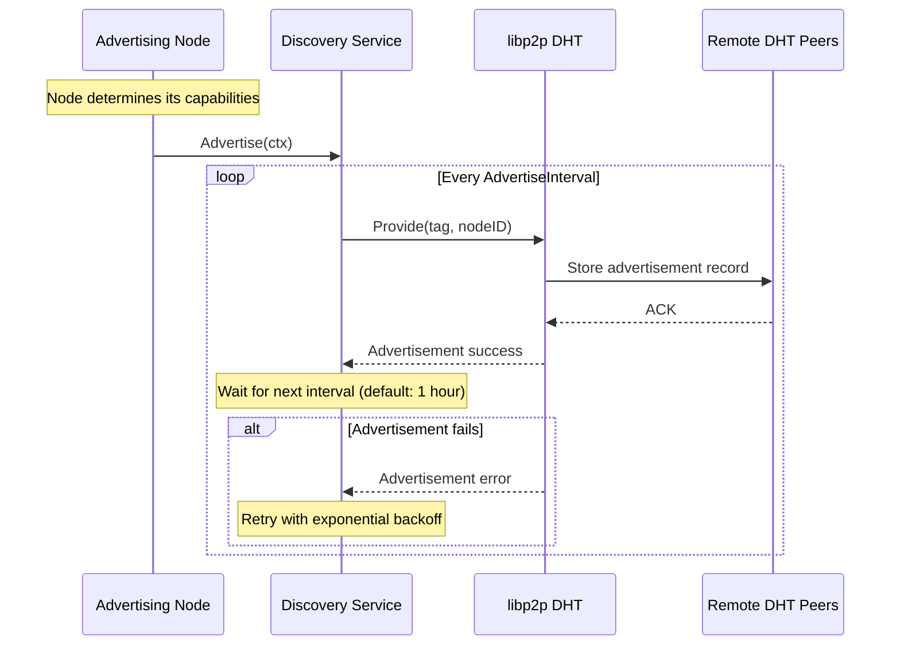
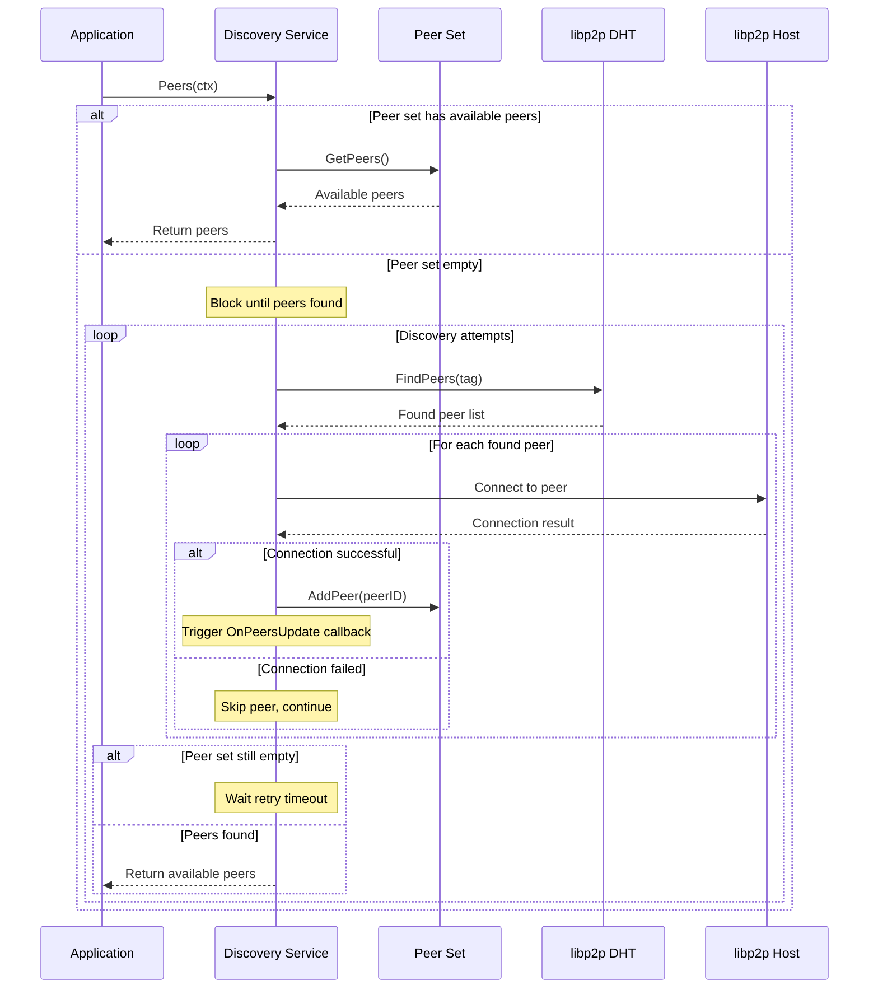

# Peer Discovery Specification for SHREX Protocol

## Abstract

This specification defines the peer discovery mechanism for the SHREX protocol in the Celestia network. The discovery service enables efficient peer location and selection for data availability sampling and share retrieval operations.

## Table of Contents

- [Terminology](#terminology)
- [Overview](#overview)
- [Protocol Specification](#protocol-specification)
  - [Discovery Tags](#discovery-tags)
  - [Discovery Parameters](#discovery-parameters)
  - [Discovery Operations](#discovery-operations)
  - [Connection Management](#connection-management)
- [Node Behavior](#node-behavior)
- [API Reference](#api-reference)
- [References](#references)
- [Requirements Language](#requirements-language)

## Terminology

- **Discovery**: The process of finding and maintaining connections to peers in the network
- **Advertisement**: The process of announcing peer presence under a specific tag
- **Parameters**: Configuration structure containing discovery settings
- **Tag**: A string identifier used to categorize peers by their capabilities
- **Active set**: A bounded collection of actively connected peers maintained by the discovery service
- **Active Connection**: A live, bidirectional connection between two peers that can carry protocol messages
- **Connectedness**: The state of connectivity between two peers (connected, disconnected, connecting, etc.)
- **Backoff**: The delay between connection attempts with a single peer.

## Overview

The discovery service REQUIRES the libp2p DHT (Distributed Hash Table) to enable nodes to find peers capable of serving specific data types. The service handles both peer advertisement (announcing capabilities) and peer discovery (finding peers with required capabilities) while maintaining an active set of connected peers.
The discovery service maintains a set in which all peers MUST have active connections with the host service. When connectedness changes from active to any other state, the peer MUST be immediately dropped and replaced through new discovery. The dropped peer SHOULD be added to a cache with backoff, so it will not be prematurely re-connected to through discovery.

## Sequence Diagrams

### Advertisement



### Peer Discovery



**Note**: Full nodes (FN) are deprecated in the current protocol implementation but remain part of this specification for completeness as they are still present in the codebase.

The discovery mechanism enables:

- **Light nodes** discover Full and Bridge nodes
- **Full and Bridge nodes** MAY discover each other for data synchronization

## Protocol Specification

### Discovery Tags

The discovery service uses specific tags to categorize peers by their data availability capabilities.

**Important**: From a discovery standpoint, full nodes and bridge nodes MUST provide the same services to light nodes. This equivalence is the rationale for both node types advertising under the same **full**/**archival** tag.

#### Tag Definitions

**Full Node Tag**: `"full"`

- **Purpose**: Identifies nodes that store recent block data
- **Capabilities**: Can serve shares for recent heights within the sampling window
- **Advertisement**: Light nodes MUST NOT advertise under this tag
- **Discovery**: All node types SHOULD discover peers under this tag

**Archival Node Tag**: `"archival"`

- **Purpose**: Identifies nodes that store historical block data beyond the sampling window
- **Capabilities**: Can serve shares for all historical heights
- **Advertisement**: Both Bridge and FULL nodes MAY advertise under this tag in case pruner service is disabled
- **Discovery**: All node types SHOULD discover peers under this tag

### Discovery Parameters

The discovery service operates with the following configurable parameters:

#### PeersLimit

- **Type**: Integer
- **Default**: 5
- **Purpose**: Maximum number of peers to maintain in the active peer set
- **Rationale**: Limits resource consumption while ensuring sufficient peer diversity for data availability

#### AdvertiseInterval

- **Type**: Duration
- **Default**: 1 hour
- **Purpose**: Interval between peer advertisements to the DHT
- **Rationale**: Balances network overhead with peer visibility, following DHT best practices

#### Backoff period

- **Type**: Duration
- **Default**: 10 Minutes
- **Purpose**: Interval between peer connection attempts
- **Rationale**: Prevents wasting resources by repeatedly trying to connect to a peer that's likely experiencing persistent issues, giving it time to recover while avoiding connection storms across the network.

#### DHT Parameters
The kad-dht is configured with default libp2p parameters and operates in different modes based on node type:
 - **dht.ModeClient** - MUST be configured for LN(consume DHT services without serving DHT queries)
 - **dht.ModeServer** MUST be configured for BN/FN(both consume and serve DHT queries to support network infrastructure)


### Discovery Operations

#### Advertisement Process

1. Nodes MUST determine their appropriate tags based on capabilities
2. Nodes SHOULD periodically advertise their presence under relevant tags
3. Advertisement includes node's peer ID and network addresses

#### Peer Discovery Process

1. Nodes MUST query the DHT for peers under specific tags
2. Discovery service maintains an active set of discovered peers
3. Peers are selected using round-robin or similar algorithms for load distribution

### Connection Management

The discovery service implements strict connection management to ensure reliable data availability:

#### Active Connection Requirements

- **Peer Set Criteria**: Only peers with active connections are maintained in the active peer set
- **Connection Monitoring**: The service MUST continuously monitor the connectedness status of all peers in the active set
- **Immediate Removal**: When a peer's connectedness changes from connected to any other state (disconnected, connecting, etc.), the peer MUST be immediately dropped from the active set
- **Backoff**: A backoff period RECOMMENDED to be added to a dropped peer to prevent wasting resources for immediate reconnection
- **Replacement Discovery**: Upon peer removal, the service MUST initiate discovery to find a replacement peer that meets the active connection criteria in case Peer Limit is not reached
- **Connection Validation**: Before adding a peer to the active set, the service MUST verify that an active connection exists and backoff is ended

#### Connection State Handling

- **Connected**: Peer is eligible for the active set and can serve requests
- **Disconnected**: Peer MUST be removed from active set immediately
- **Connecting**: Peer is not eligible for active set until connection becomes active
- **Other States**: All non-connected states result in peer removal from active set

## Node Behavior

### Light Nodes

- MUST NOT advertise themselves under any discovery tags
- MUST discover peers under "full" and "archival" tags for data retrieval
- SHOULD prioritize recently discovered peers for load distribution

### Full Nodes (Deprecated)

- MUST advertise under "full" tag if active
- MAY advertise under "archival" tag if pruner service is disabled
- MAY discover other nodes

### Bridge Nodes

- MUST advertise under "full" tag
- MAY advertise under "archival" tag if pruner service is disabled
- MAY discover other nodes
- SHOULD maintain persistent advertisement to ensure network availability

## API Reference

### Advertisement Interface

```text
// Advertise announces the node's presence under specified tags
Advertise(context, tags) -> error
```

### Discovery Interface

```text
// Peers returns discovered peers, blocking until at least one peer is found
Peers(context) -> ([]PeerID, error)
```

### Connection Management Interface

```text
// OnConnectionChange handles connection state changes for discovered peers
OnConnectionChange(peerID, connectedness) -> void
```

## References

1. **Celestia Node**: <https://github.com/celestiaorg/celestia-node>
2. **libp2p kad-DHT Specification**: <https://docs.libp2p.io/concepts/discovery-routing/kaddht>

## Requirements Language

The key words "MUST", "MUST NOT", "REQUIRED", "SHALL", "SHALL NOT", "SHOULD", "SHOULD NOT", "RECOMMENDED", "MAY", and "OPTIONAL" in this document are to be interpreted as described in RFC 2119.
