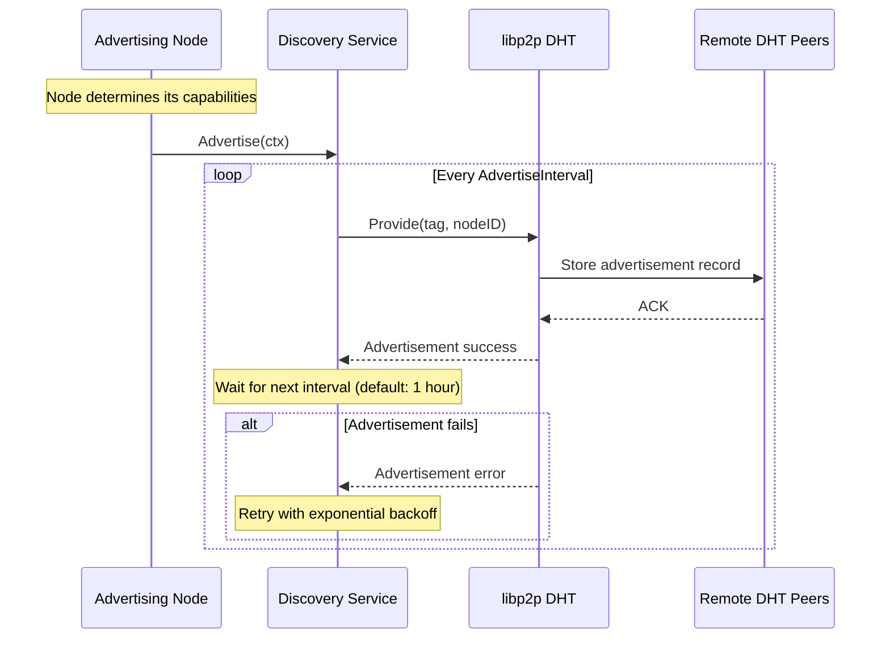
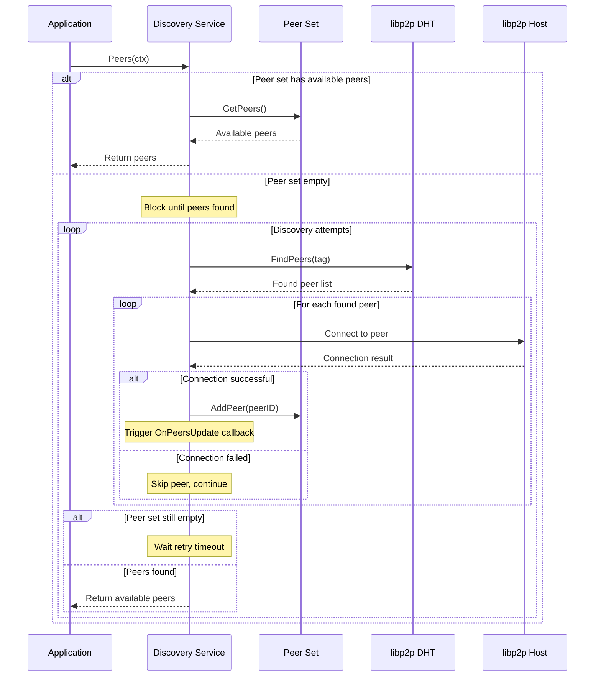

# Peer Discovery Specification for SHREX Protocol

## Abstract

This specification defines the peer discovery mechanism for the SHREX protocol in the Celestia network. The discovery service enables efficient peer location and selection for data availability sampling and share retrieval operations.

## Table of Contents

- [Terminology](#terminology)
- [Overview](#overview)
- [Protocol Specification](#protocol-specification)
  - [Discovery Tags](#discovery-tags)
  - [Discovery Parameters](#discovery-parameters)
  - [Discovery Operations](#discovery-operations)
- [Node Behavior](#node-behavior)
- [API Reference](#api-reference)
- [References](#references)
- [Requirements Language](#requirements-language)

## Terminology

- **Discovery**: The process of finding and maintaining connections to peers in the network
- **Advertisement**: The process of announcing peer presence under a specific tag
- **Parameters**: Configuration structure containing discovery settings
- **Tag**: A string identifier used to categorize peers by their capabilities

## Overview

The discovery service REQUIRES the libp2p DHT (Distributed Hash Table) to enable nodes to find peers capable of serving specific data types. The service handles both peer advertisement (announcing capabilities) and peer discovery (finding peers with required capabilities).

## Sequence Diagrams

### Advertisement



### Peer Discovery



**Note**: Full nodes (FN) are deprecated in the current protocol implementation but remain part of this specification for completeness as they are still present in the codebase.

The discovery mechanism enables:

- **Light nodes** discover Full and Bridge nodes
- **Full and Bridge nodes** MAY discover each other for data synchronization

## Protocol Specification

### Discovery Tags

The discovery service uses specific tags to categorize peers by their data availability capabilities:

#### Tag Definitions

**Full Node Tag**: `"full"`

- **Purpose**: Identifies nodes that store recent block data
- **Capabilities**: Can serve shares for recent heights within the sampling window
- **Advertisement**: Light nodes MUST NOT advertise under this tag
- **Discovery**: All node types SHOULD discover peers under this tag

**Archival Node Tag**: `"archival"`

- **Purpose**: Identifies nodes that store historical block data beyond the sampling window
- **Capabilities**: Can serve shares for all historical heights
- **Advertisement**: Both Bridge and FULL nodes MAY advertise under this tag in case pruner service is disabled
- **Discovery**: All node types SHOULD discover peers under this tag

### Discovery Parameters

The discovery service operates with the following configurable parameters:

#### PeersLimit

- **Type**: Integer
- **Default**: 5
- **Purpose**: Maximum number of peers to maintain in the limited peer set
- **Rationale**: Limits resource consumption while ensuring sufficient peer diversity for data availability

#### AdvertiseInterval

- **Type**: Duration
- **Default**: 1 hour
- **Purpose**: Interval between peer advertisements to the DHT
- **Rationale**: Balances network overhead with peer visibility, following DHT best practices

### Discovery Operations

#### Advertisement Process

1. Nodes MUST determine their appropriate tags based on capabilities
2. Nodes SHOULD periodically advertise their presence under relevant tags
3. Advertisement includes node's peer ID and network addresses

#### Peer Discovery Process

1. Nodes MUST query the DHT for peers under specific tags
2. Discovery service maintains a limited set of discovered peers
3. Peers are selected using round-robin or similar algorithms for load distribution

## Node Behavior

### Light Nodes

- MUST NOT advertise themselves under any discovery tags
- MUST discover peers under "full" and "archival" tags for data retrieval
- SHOULD prioritize recently discovered peers for load distribution

### Full Nodes (Deprecated)

- MUST advertise under "full" tag if active
- MAY advertise under "archival" tag if pruner service is disabled
- MAY discover other nodes

### Bridge Nodes

- MUST advertise under "full" tag
- MAY advertise under "archival" tag if pruner service is disabled
- MAY discover other nodes
- SHOULD maintain persistent advertisement to ensure network availability

## API Reference

### Advertisement Interface

```text
// Advertise announces the node's presence under specified tags
Advertise(context, tags) -> error
```

### Discovery Interface

```text
// Peers returns discovered peers, blocking until at least one peer is found
Peers(context) -> ([]PeerID, error)
```

## References

1. **Celestia Node**: <https://github.com/celestiaorg/celestia-node>
2. **libp2p Discovery**: <https://docs.libp2p.io/concepts/protocols/#peer-discovery>
3. **libp2p DHT Specification**: <https://github.com/libp2p/specs/tree/master/kad-dht>

## Requirements Language

The key words "MUST", "MUST NOT", "REQUIRED", "SHALL", "SHALL NOT", "SHOULD", "SHOULD NOT", "RECOMMENDED", "MAY", and "OPTIONAL" in this document are to be interpreted as described in RFC 2119.
