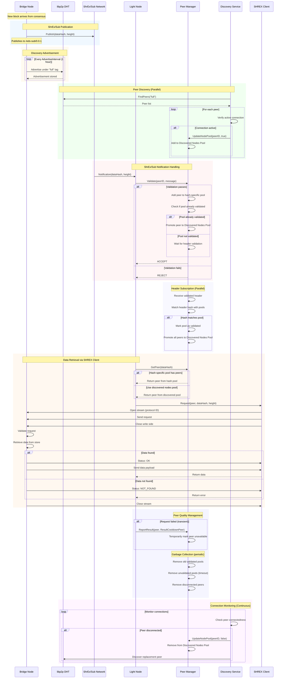

# SHREX Protocol Specification

## Abstract

This specification defines the SHREX (Share Exchange) protocol for the Celestia network. SHREX is a comprehensive data availability protocol that enables efficient peer-to-peer data exchange through multiple coordinated components: a request-response protocol for data retrieval, a push-based notification system for new block availability, peer discovery mechanisms, and peer management for optimal routing. Together, these components provide a complete solution for data availability sampling and retrieval.

## Motivation

The SHREX protocol addresses the critical need for efficient data availability sampling. As a DA layer, Celestia requires mechanisms for light nodes to sample and retrieve data from full(deprecated soon) and bridge nodes without downloading entire blocks. The protocol's design goals include:

- **Efficient Data Retrieval**: Request-response protocol enabling targeted data requests to specific peers
- **Proactive Notifications**: Push-based announcements of new block availability to reduce discovery latency
- **Optimal Peer Selection**: Intelligent peer management and discovery for reliable and efficient data access
- **Scalable Architecture**: Support for diverse node types with varying storage and bandwidth capabilities
- **Network Resilience**: Redundant peer pools and validation mechanisms to ensure data availability

By combining these components, SHREX enables light nodes to perform data availability sampling with minimal bandwidth overhead while maintaining security guarantees.

## Table of Contents

- [Overview](#overview)
- [Architecture](#architecture)
  - [Component Overview](#component-overview)
  - [Node Types](#node-types)
- [Client/Server Protocol](#clientserver-protocol)
  - [Transport Protocol](#transport-protocol)
  - [Message Format](#message-format)
  - [Supported Endpoints](#supported-endpoints)
  - [Client Behavior](#client-behavior)
  - [Server Behavior](#server-behavior)
  - [Resource Protection](#resource-protection)
- [ShrEx/Sub Protocol](#shrexsub-protocol)
  - [Message Schema](#message-schema)
  - [Protocol Components](#protocol-components)
  - [Message Verification](#message-verification)
  - [Publisher Behavior](#publisher-behavior)
  - [Subscriber Behavior](#subscriber-behavior)
  - [FloodSub vs GossipSub Rationale](#floodsub-vs-gossipsub-rationale)
- [Peer Discovery](#peer-discovery)
  - [Discovery Tags](#discovery-tags)
  - [Discovery Parameters](#discovery-parameters)
  - [Discovery Operations](#discovery-operations)
  - [Connection Management](#connection-management)
  - [Node-Specific Discovery Behavior](#node-specific-discovery-behavior)
- [Peer Manager](#peer-manager)
  - [Header Subscription](#header-subscription)
  - [ShrEx/Sub Integration](#shrexsub-integration)
  - [Discovery Integration](#discovery-integration)
  - [Peer Pools](#peer-pools)
  - [Peer Selection](#peer-selection)
  - [Validation and Quality Control](#validation-and-quality-control)
  - [Parameters](#parameters)
- [Complete Protocol Flow](#complete-protocol-flow)
- [Links](#links)
- [Requirements Language](#requirements-language)

## Overview

SHREX is a protocol suite that combines four key components to enable efficient data availability in the Celestia network:

1. **Client/Server Protocol**: Request-response mechanism for retrieving specific data from peers
2. **ShrEx/Sub Protocol**: Push-based notification system for new block availability announcements
3. **Peer Discovery**: DHT-based mechanism for finding peers with required capabilities
4. **Peer Manager**: Central coordination point for peer selection and pool management

These components work together to provide a complete data availability solution where light nodes can efficiently discover, track, and retrieve data from bridge nodes.

## Architecture

### Component Overview

The SHREX protocol architecture consists of interconnected components that handle different aspects of data availability:

```text
┌─────────────────────────────────────────────────────────────┐
│                        Light Node                           │
├─────────────────────────────────────────────────────────────┤
│                                                             │
│  ┌────────────────────────────────────────────────────┐     │
│  │              Peer Manager                          │     │
│  │  - Maintains validated peer pools                  │     │
│  │  - Selects optimal peers for requests              │     │
│  │  - Validates ShrEx/Sub notifications               │     │
│  └──────┬──────────────────────┬──────────────────┬───┘     │
│         │                      │                  │         │
│         │                      │                  │         │
│  ┌──────▼────────┐    ┌────────▼────────┐  ┌─────▼──────┐   │
│  │  ShrEx/Sub    │    │   Discovery     │  │  SHREX     │   │
│  │  Subscriber   │    │   Service       │  │  Client    │   │
│  │               │    │                 │  │            │   │
│  └───────────────┘    └─────────────────┘  └────────────┘   │
│                                                             │
└─────────────────────────────────────────────────────────────┘
                              │
                              │ Network
                              │
┌─────────────────────────────────────────────────────────────┐
│                    Bridge Node                              │
├─────────────────────────────────────────────────────────────┤
│                                                             │
│  ┌────────────────┐    ┌──────────────┐  ┌──────────────┐   │
│  │  ShrEx/Sub     │    │  Discovery   │  │   SHREX      │   │
│  │  Publisher     │    │  Service     │  │   Server     │   │
│  │                │    │              │  │              │   │
│  └────────────────┘    └──────────────┘  └──────────────┘   │
│                                                             │
└─────────────────────────────────────────────────────────────┘
```

### Node Types

The SHREX protocol supports three node types with distinct roles:

**Light Nodes (LN)**:

- Subscribe to ShrEx/Sub notifications
- Discover bridge nodes via DHT
- Request data via SHREX client
- Do NOT advertise themselves or serve data

**Bridge Nodes (BN)**:

- Publish ShrEx/Sub notifications
- Advertise under "full" tag (and "archival" if pruner disabled)
- Serve data via SHREX server
- Store all block data (recent and historical)

## Client/Server Protocol

The SHREX Client/Server protocol implements a request-response architecture for data exchange, enabling nodes to retrieve specific data from peers using libp2p streaming.

### Transport Protocol

SHREX uses libp2p streaming as its transport layer with protocol identifiers following the format:

```text
/<network-id>/shrex/v0.1.0/<request-name>
```

Where:

- `<network-id>`: Network identifier
- `/shrex/v0.1.0/`: Protocol name and version
- `<request-name>`: Type of request (e.g., "row", "sample", "eds")

#### Stream Lifecycle

1. **Stream Opening**: Client opens a new stream to the server using the protocol ID
2. **Request Phase**: Client writes request and closes the write side
3. **Response Phase**: Server sends status message
    - If status is `OK`: Server sends data payload, then closes stream
    - If status is not `OK`: Server closes stream immediately
4. **Stream Closing**: Stream is closed after response is complete

#### Timeouts

Both client and server implement timeouts to protect resources:

- **Read Timeout**: Maximum time to read data from stream
- **Write Timeout**: Maximum time to write data to stream
- **Handle Request Timeout**: Maximum time for server to process request

### Message Format

#### Encoding

Request and response messages use different encoding schemes:

- **Request Messages**: Binary encoded using `MarshalBinary()` method
- **Response Messages**: Protocol Buffers (protobuf) encoded

#### Request Messages

Requests use SHWAP ID and associated encoding. Each request type includes:

- Height: Block height for the requested data
- Type-specific parameters

#### Response Messages

##### Status Message

After handling requests, server MUST send Status message indicating result of handling:

```protobuf
enum Status {
   INVALID = 0;      // Invalid/unknown status
   OK = 1;           // Data found and will be sent
   NOT_FOUND = 2;    // Requested data not found
   INTERNAL = 3;     // Internal server error
}

message Response {
   Status status = 1;
}
```

##### Data Payload

Data is only sent when status is `OK`. After sending the OK status, the server streams the requested data and then closes the stream.

For all other status codes (`NOT_FOUND`, `INTERNAL`), the server closes the stream immediately after sending the status message without sending any data.

The format and encoding of the data payload is defined in the [SHWAP](https://github.com/celestiaorg/CIPs/blob/main/cips/cip-019.md) specification.

For certain request types (e.g., GetNamespaceData), a non-inclusion proof MAY be sent instead of data when the namespace is not present.

### Supported Endpoints

SHREX supports multiple endpoint types for retrieving different kinds of data. All endpoints follow the same request-response pattern but return different data structures.

All ProtocolIDs MUST be prefixed with the `networkID`.

| ProtocolID                                       | Request                                                                                                                                                           | Response                                                                                                                                                     |
|--------------------------------------------------|-------------------------------------------------------------------------------------------------------------------------------------------------------------------|--------------------------------------------------------------------------------------------------------------------------------------------------------------|
| `<networkID>/shrex/v0.1.0/row_v0`                | [RowID](https://github.com/celestiaorg/CIPs/blob/main/cips/cip-019.md#rowid)                                                                                      | [Row](https://github.com/celestiaorg/CIPs/blob/main/cips/cip-019.md#row-container)                                                                           |
| `<networkID>/shrex/v0.1.0/sample_v0`             | [SampleID](https://github.com/celestiaorg/CIPs/blob/main/cips/cip-019.md#sampleid)                                                                                | [Sample](https://github.com/celestiaorg/CIPs/blob/main/cips/cip-019.md#sample-container)                                                                     |
| `<networkID>/shrex/v0.1.0/nd_v0`                 | [NamespaceDataID](https://github.com/celestiaorg/celestia-node/blob/2c991a8cbb3be9afd413472e127b0e2b6e770100/share/shwap/namespace_data_id.go#L21C1-L26C2)        | [NamespaceData](https://github.com/celestiaorg/celestia-node/blob/2c991a8cbb3be9afd413472e127b0e2b6e770100/share/shwap/namespace_data.go#L20)                |
| `<networkID>/shrex/v0.1.0/eds_v0`                | [EdsID](https://github.com/celestiaorg/CIPs/blob/main/cips/cip-019.md#edsid)                                                                                      | [Eds](https://github.com/celestiaorg/CIPs/blob/main/cips/cip-019.md#eds-container)                                                                           |
| `<networkID>/shrex/v0.1.0/rangeNamespaceData_v0` | [RangeNamespaceDataID](https://github.com/celestiaorg/celestia-node/blob/2c991a8cbb3be9afd413472e127b0e2b6e770100/share/shwap/range_namespace_data_id.go#L31-L37) | [RangeNamespaceData](https://github.com/celestiaorg/celestia-node/blob/2c991a8cbb3be9afd413472e127b0e2b6e770100/share/shwap/range_namespace_data.go#L38-L42) |

### Client Behavior

The SHREX client is responsible for:

- Connecting to a specified peer
- Sending a data request
- Receiving and validating the status response
- Reading the data payload (if status is OK)
- Returning the result to the caller

#### Input and Output

**Input**:

- Target peer ID
- Request parameters (height, type-specific data)

**Output**:

- Retrieved data (on success)
- Error information (on failure)

#### Request Flow

```text
┌──────────┐         ┌────────────┐         ┌────────┐
│  Getter  │         │   Client   │         │ Server │
└────┬─────┘         └─────┬──────┘         └───┬────┘
     │                     │                    │
     │ Request(peer, data) │                    │
     ├────────────────────>│                    │
     │                     │                    │
     │                     │ Open Stream        │
     │                     ├───────────────────>│
     │                     │                    │
     │                     │ Send Request       │
     │                     ├───────────────────>│
     │                     │                    │
     │                     │ Close Write        │
     │                     ├───────────────────>│
     │                     │                    │
     │                     │ Receive Status     │
     │                     │<───────────────────┤
     │                     │                    │
     │                     │ Receive Data       │
     │                     │ (if status OK)     │
     │                     │<───────────────────┤
     │                     │                    │
     │ Return Data/Error   │                    │
     │<────────────────────┤                    │
     │                     │                    │
```

#### Error Handling

The client maps status codes to errors:

| Status Code | Error | Description |
|------------|-------|-------------|
| `OK` | None | Success, data received |
| `NOT_FOUND` | `ErrNotFound` | Requested data not available |
| `INTERNAL` | `ErrInternalServer` | Server encountered an error |
| `INVALID` or unknown | `ErrInvalidResponse` | Invalid or unexpected status |

Additional client-side errors:

- **Connection Errors**: Stream opening failures
- **Timeout Errors**: Request exceeded time limits

### Server Behavior

The SHREX server is responsible for:

- Accepting incoming connections
- Reading and validating requests
- Retrieving data from local storage
- Sending status responses
- Sending data payloads (when applicable)
- Sending non-inclusion proofs (for certain request types when data not found)

#### Request Handling

```text
                Incoming Stream
                       │
                       ▼
                 ┌──────────────┐
                 │ Read Request │
                 └──────┬───────┘
                        │
                ┌───────┴────────┐
                │                │
             Error            Success
                │                │
                ▼                ▼
         ┌───────────┐    ┌─────────────┐
         │ Reset     │    │ Close Read  │
         │ Stream    │    │             │
         └───────────┘    └──────┬──────┘
                                 │
                                 ▼
                          ┌──────────────┐
                          │ Validate     │
                          │ Request      │
                          └──────┬───────┘
                                 │
                         ┌───────┴────────┐
                         │                │
                      Invalid          Valid
                         │                │
                         ▼                ▼
                    ┌──────────┐    ┌─────────────┐
                    │ Reset    │    │ Get Data    │
                    │ Stream   │    │ from Store  │
                    └──────────┘    └──────┬──────┘
                                           │
                                           ▼
                                    ┌──────────────┐
                                    │ Set Write    │
                                    │ Deadline     │
                                    └──────┬───────┘
                                           │
                                   ┌───────┴────────┐
                                   │                │
                                 Found          Not Found
                                   │                │
                                   ▼                ▼
                              ┌──────────┐    ┌──────────┐
                              │ Send OK  │    │ Send NOT │
                              │ Status   │    │ FOUND    │
                              └────┬─────┘    │ Status   │
                                   │          └──────────┘
                                   ▼
                              ┌──────────┐
                              │ Send     │
                              │ Data     │
                              └──────────┘
```

#### Status Response Behavior

The server sends status codes based on the following conditions:

| Status Code | Condition | Stream Behavior |
|------------|-----------|-----------------|
| `OK` | Data found and ready | Send status, then send data |
| `NOT_FOUND` | Data not in store | Send status, close stream |
| `INTERNAL` | Error retrieving data | Send status, close stream |
| N/A (no status sent) | Invalid request | Reset stream without response |
| N/A (no status sent) | Error reading request | Reset stream without response |

### Resource Protection

The protocol includes mechanisms to protect node resources:

- **Timeouts**: Requests have time limits to prevent resource exhaustion
- **Validation**: Invalid requests are rejected early to save resources

## ShrEx/Sub Protocol

**ShrEx/Sub** (Share Exchange/Subscribe) is a push-based notification protocol implementing the publish-subscribe pattern for new block availability notifications in the data availability network. The protocol enables efficient dissemination of new block availability information, allowing the Peer Manager to build and maintain pools of reliable peers for optimal data access.

ShrEx/Sub is built on libp2p's FloodSub router with the following characteristics:

- **Topic ID**: `/eds-sub/0.0.1`
- **Message Distribution**: Flood-based (sends to all connected peers)

### Message Schema

The notification message MUST contain the EDS data hash and block height:

```text
Notification {
    data_hash: bytes[32]  // root hash
    height: uint64        // block height
}
```

**Encoding**: Protocol Buffers (protobuf) serialization

**Properties:**

- Messages MUST have a fixed 40-byte payload (32 bytes hash + 8 bytes height)
- Serialization overhead SHOULD be minimal
- Each EDS at a specific height SHOULD produce only a single notification

### Protocol Components

#### PubSub Component

The core publish-subscribe functionality for message distribution:

**Interface Methods:**

```text
// Publish publishes data hash and height to the topic
Publish(dataHash []byte, height uint64) -> error

// Subscribe creates a new subscription to the topic
Subscribe() -> (*Subscription, error)
```

**Requirements:**

- Publishers MUST use the topic ID `/eds-sub/0.0.1`
- The Publish method MUST validate input parameters before publishing
- The Subscribe method MUST return a valid subscription or an error

#### Subscription Component

The subscription component handles the receiving and processing of ShrEx/Sub notifications:

**Interface Methods:**

```text
// Next blocks the caller until any new EDS DataHash notification arrives.
// Returns only notifications which successfully pass validation.
Next() -> (Notification, error) 
```

**Requirements:**

- Implementations MUST maintain an active subscription to `/eds-sub/0.0.1` topic
- Incoming notifications MUST be processed through the validation pipeline
- Only validated notifications SHALL be distributed to registered listeners

### Message Verification

#### Validation Interface

**MessageValidator Interface:**

```text
// Validate validates a message from a peer
Validate(peerID PeerID, message []byte) -> ValidationResult
```

**ValidationResult Values:**

- `ACCEPT`: Message is valid and MUST be processed
- `REJECT`: Message is invalid and MUST be discarded

The validation interface is exposed specifically for integration with the Peer Manager, which implements this interface to validate incoming ShrEx/Sub notifications. The Peer Manager uses validation results to add the announcing peer to the appropriate data hash pool, making them available for future data requests.

#### Validation Pipeline

ShrEx/Sub implementations MUST implement the following validation process:

**Sanity Checks:**

- Hash length MUST be exactly 32 bytes
- Hash MUST NOT be all zeros
- Message size MUST NOT exceed protocol limits
- Height MUST be a non-zero positive integer

**Verification Checks:**

- Height MUST correspond to a block header that is fully verified by the implementation
- The block header at the given height MUST be included as part of the implementation's subjective chain
- The data hash MUST match the data root hash from the verified header at the specified height

#### Component Interaction Flow

```text
1. PubSub receives message from network
2. Subscription processes message through validation
3. Validated messages sent to registered listeners
```

### Publisher Behavior

- **Trigger**: Publishers MUST only broadcast messages when they subjectively determine they are synced to the network and the EDS corresponds to a height at the current network tip
- **Action**: Publishers MUST publish EDS hash and height to `/eds-sub/0.0.1` topic
- **Frequency**: Each EDS MUST be published exactly once per height
- **Validation**: Publishers MUST only publish hashes for locally validated EDS

### Subscriber Behavior

- **Subscription**: Subscribers MUST maintain an active subscription to `/eds-sub/0.0.1`
- **Processing**: Subscribers MUST validate received hash format and height
- **Action**: Subscribers MUST process notifications through registered listeners

### FloodSub vs GossipSub Rationale

#### Why not GossipSub?

In celestia-node, we extensively use libp2p's GossipSub router, which provides bandwidth-efficient yet secure message dissemination over Celestia's DA p2p network. However, it is not well suited for exchanging recent EDS notifications.

GossipSub's efficacy comes from an overlay mesh network based on "physical" connections. Peers form logical links and every gossip is *pushed* only to these peers in the mesh. A new logical link is established on every new "physical" connection. When there are too many logical links (>DHi), random logical links are pruned. However, there is no differentiation between peer types so pruning can happen to any peer.

GossipSub implements peer exchange with pruned peers - when BN has too many links, it may prune an LN and then send it a bunch of peers that are not guaranteed to be BNs. Therefore, the LN can end up isolated with other LNs from new EDS notifications.

#### Why FloodSub?

FloodSub, on the other hand, sends messages to every "physical" connection without overlay mesh of logical links, which solves the problem with the cost of higher message duplication factor on the network. Although, a moderate amount of duplicates from different peers are helpful in this case. If the primary message sender peer does not serve data, the senders of duplicates are requested instead.

**Trade-offs:**

- **Higher Message Duplication**: Each message sent to every connection
- **Bandwidth Cost**: ~40 bytes × peer_count per notification (32 bytes hash + 8 bytes height)
- **Acceptable**: Given small message size and notification frequency

**Additional Notes**:

Besides *pushing* gossip, GossipSub has an internal *lazy-push* mechanism. Randomly connected peers outside the overlay mesh are selected and sent `IHAVE` messages (hash of the actual message) and can respond with `IWANT`. In the case of an isolated LN, there is a chance that it will still receive the data via the lazy-pull mechanism; however, it is randomized, and thus the isolated node can miss notifications.

We could increase GossipFactor to 1, which means always sending `IHAVE` to every connected peer outside the overlay mesh. However, the notification message is a hash, and there is no reason to pull the hash by its hash compared to a direct push of the hash.

## Peer Discovery

The peer discovery service enables efficient peer location and selection for data availability sampling and share retrieval operations. The discovery service REQUIRES the libp2p DHT (Distributed Hash Table) to enable nodes to find peers capable of serving specific data types.

### Terminology

- **Discovery**: The process of finding and maintaining connections to peers in the network
- **Advertisement**: The process of announcing peer presence under a specific tag
- **Parameters**: Configuration structure containing discovery settings
- **Tag**: A string identifier used to categorize peers by their capabilities
- **Active set**: A bounded collection of actively connected peers maintained by the discovery service
- **Active Connection**: A live, bidirectional connection between two peers that can carry protocol messages
- **Connectedness**: The state of connectivity between two peers (connected, disconnected, connecting, etc.)
- **Backoff**: The delay between connection attempts with a single peer

The discovery service maintains a set in which all peers MUST have active connections with the host service. When connectedness changes from active to any other state, the peer MUST be immediately dropped and replaced through new discovery. The dropped peer SHOULD be added to a cache with backoff, so it will not be prematurely re-connected to through discovery.

### Discovery Tags

The discovery service uses specific tags to categorize peers by their data availability capabilities.

#### Tag Definitions

**Full Node Tag**: `"full"`

- **Purpose**: Identifies nodes that store recent block data
- **Capabilities**: Can serve shares for recent heights within the sampling window
- **Advertisement**: Light nodes MUST NOT advertise under this tag
- **Discovery**: All node types SHOULD discover peers under this tag

**Archival Node Tag**: `"archival"`

- **Purpose**: Identifies nodes that store historical block data beyond the sampling window
- **Capabilities**: Can serve shares for all historical heights
- **Discovery**: All node types SHOULD discover peers under this tag

### Discovery Parameters

The discovery service operates with the following configurable parameters:

#### PeersLimit

- **Type**: Integer
- **Default**: 5
- **Purpose**: Maximum number of peers to maintain in the active peer set
- **Rationale**: Limits resource consumption while ensuring sufficient peer diversity for data availability

#### AdvertiseInterval

- **Type**: Duration
- **Default**: 1 hour
- **Purpose**: Interval between peer advertisements to the DHT
- **Rationale**: Balances network overhead with peer visibility, following DHT best practices

#### Backoff Period

- **Type**: Duration
- **Default**: 10 Minutes
- **Purpose**: Interval between peer connection attempts
- **Rationale**: Prevents wasting resources by repeatedly trying to connect to a peer that's likely experiencing persistent issues, giving it time to recover while avoiding connection storms across the network

#### DHT Parameters

The kad-dht is configured with default libp2p parameters and operates in different modes based on node type:

- **dht.ModeClient** - MUST be configured for LN (consume DHT services without serving DHT queries)
- **dht.ModeServer** - MUST be configured for BN/FN (both consume and serve DHT queries to support network infrastructure)

### Discovery Operations

#### Advertisement Process

1. Nodes MUST determine their appropriate tags based on capabilities
2. Nodes SHOULD periodically advertise their presence under relevant tags
3. Advertisement includes node's peer ID and network addresses

#### Peer Discovery Process

1. Nodes MUST query the DHT for peers under specific tags
2. Discovery service maintains an active set of discovered peers
3. Peers are selected using round-robin or similar algorithms for load distribution

### Connection Management

The discovery service implements strict connection management to ensure reliable data availability:

#### Active Connection Requirements

- **Peer Set Criteria**: Only peers with active connections are maintained in the active peer set
- **Connection Monitoring**: The service MUST continuously monitor the connectedness status of all peers in the active set
- **Immediate Removal**: When a peer's connectedness changes from connected to any other state (disconnected, connecting, etc.), the peer MUST be immediately dropped from the active set
- **Backoff**: A backoff period is RECOMMENDED to be added to a dropped peer to prevent wasting resources for immediate reconnection
- **Replacement Discovery**: Upon peer removal, the service MUST initiate discovery to find a replacement peer that meets the active connection criteria in case Peer Limit is not reached
- **Connection Validation**: Before adding a peer to the active set, the service MUST verify that an active connection exists and backoff is ended

#### Connection State Handling

- **Connected**: Peer is eligible for the active set and can serve requests
- **Disconnected**: Peer MUST be removed from active set immediately
- **Connecting**: Peer is not eligible for active set until connection becomes active
- **Other States**: All non-connected states result in peer removal from active set

### Node-Specific Discovery Behavior

#### Light Nodes

- MUST NOT advertise themselves under any discovery tags
- MUST discover peers under "full" and "archival" tags for data retrieval
- SHOULD prioritize recently discovered peers for load distribution

#### Bridge Nodes

- MUST advertise under "full" tag
- MAY advertise under "archival" tag if pruner service is disabled
- MAY discover other nodes
- SHOULD maintain persistent advertisement to ensure network availability

### API Reference

#### Advertisement Interface

```text
// Advertise announces the node's presence under specified tags
Advertise(context, tags) -> error
```

#### Discovery Interface

```text
// Peers returns discovered peers, blocking until at least one peer is found
Peers(context) -> ([]PeerID, error)
```

#### Connection Management Interface

```text
// OnConnectionChange handles connection state changes for discovered peers
OnConnectionChange(peerID, connectedness) -> void
```

## Peer Manager

The Peer Manager component serves as the central coordination point for peer selection in the SHREX protocol. It aggregates peers from two primary sources: ShrEx/Sub notifications (peers announcing specific data availability through pubsub) and the Discovery service (peers found through DHT-based discovery).

The manager maintains hash pools by creating a pool for each data hash when first announced via ShrEx/Sub, then validates these pools by matching them against headers received from its header subscription (representing the node's subjective view of the chain). Once a pool is validated through header matching, all peers in that pool are promoted to the discovered nodes pool. Pools that are not validated within a timeout are garbage collected. This validation mechanism ensures the manager provides the best request routing possible.

### Flowchart: Adding Peers to the Manager

```text
                    ┌─────────────────────────────┐
                    │   Peer Announcement Source  │
                    └────────────┬────────────────┘
                                 │
                ┌────────────────┴────────────────┐
                │                                 │
                ▼                                 ▼
   ┌─────────────────────┐         ┌─────────────────────┐
   │  ShrEx/Sub Protocol │         │  Discovery Service  │
   │  Notification       │         │  Event              │
   └──────────┬──────────┘         └──────────┬──────────┘
              │                               │
              │                               │
              ▼                               ▼
   ┌─────────────────────┐         ┌─────────────────────┐
   │  Validator Function │         │  Add directly to    │
   │  - Self check       │         │  Discovered Nodes   │
   │  - Deduplication    │         │  Pool               │
   │  - Filtering        │         └─────────────────────┘
   └──────────┬──────────┘
              │
              ▼
      ┌───────────────┐
      │  Valid?       │
      └───┬───────────┘
          │
    ┌─────┴─────┐
    │           │
   No          Yes
    │           │
    ▼           ▼
 ┌─────┐   ┌─────────────────────┐
 │Reject│  │ Add to Hash-Specific│
 └─────┘   │ Pool                │
           └──────────┬──────────┘
                      │
                      ▼
           ┌─────────────────────┐
           │ Check: Is pool      │
           │ already validated?  │
           └──────────┬──────────┘
                      │
              ┌───────┴───────┐
              │               │
             No              Yes
              │               │
              ▼               ▼
    ┌─────────────────┐   ┌─────────────────────┐
    │ Wait for header │   │ Promote peer to     │
    │ validation      │   │ Discovered Nodes    │
    └─────────────────┘   │ Pool                │
                          └─────────────────────┘
           

    ┌──────────────────────────────────────┐
    │     Header Subscription (Parallel)   │
    └──────────────────┬───────────────────┘
                       │
                       ▼
            ┌─────────────────────┐
            │ Receive validated   │
            │ header              │
            └──────────┬──────────┘
                       │
                       ▼
            ┌─────────────────────┐
            │ Match header hash   │
            │ with pools          │
            └──────────┬──────────┘
                       │
                       ▼
            ┌─────────────────────┐
            │ Mark pool as        │
            │ validated           │
            └──────────┬──────────┘
                       │
                       ▼
            ┌─────────────────────┐
            │ Promote all peers   │
            │ from pool to        │
            │ Discovered Nodes    │
            └─────────────────────┘
```

### Header Subscription

The manager MUST subscribe to header updates to validate peer pools:

- Pools are validated by matching announced data hashes against headers that have been validated and added as part of the node's subjective view of the chain
- The manager MUST track the initial header height and maintain a threshold for valid pools
- The manager tracks the initial header height (the first header received after start-up, representing the node's subjective head at initialization)
- The manager maintains a rolling validation window that keeps pools for approximately the most recent 10 headers, ignoring announcements for older heights
- Only pools validated through this header matching process are considered valid

### ShrEx/Sub Integration

The manager MUST act as a message validator for ShrEx/Sub:

- All incoming data availability notifications MUST be validated
- Peers MUST be added to data-hash-specific pools based on valid notifications
- If the data hash pool is already validated, the peer MUST be immediately added to discovered nodes pool as well

#### Notification Handling

The manager uses a validator function to process incoming notifications from shrex-sub and perform deduplication:

- Notifications from the node itself are accepted
- Duplicate or outdated notifications are filtered out to maintain data freshness
- Valid notifications result in peers being added to data-hash-specific pools
- If the data hash pool is already validated, the peer is immediately promoted to the discovered nodes pool

### Discovery Integration

The manager MUST provide an `UpdateNodePool` interface for the discovery service:

- Discovery MUST add newly found peers via `UpdateNodePool(peerID, isAdded=true)`
- Discovery MUST remove disconnected peers via `UpdateNodePool(peerID, isAdded=false)`

### Peer Pools

#### Data Hash Pools

Peers are organized by the data hashes they announce:

- **Creation**: Pools MUST be created when ShrEx/Sub notifications arrive for a data hash
- **Population**: Peers MUST be added to pools when they announce specific data hashes via ShrEx/Sub
- **Validation**: Pools MUST track validation status until a matching header arrives from header subscription
- **Promotion**: When a pool becomes validated (or is already validated), peers MUST be added to the discovered nodes pool
- **Storage**: Only recent pools MUST be kept (based on configurable depth from latest header)

#### Discovered Nodes Pool

A general pool of peers available for data retrieval:

- **From Discovery**: Peers found through the discovery service MUST be added directly
- **From Validated Pools**: Peers from data hash pools MUST be promoted here once their pool is validated

### Peer Selection

The manager MUST implement prioritized peer selection:

1. **First Priority**: Peers from validated data-hash-specific pools
2. **Second Priority**: Peers from discovered nodes pool
3. **Blocking**: Wait for peers if none available (subject to context timeout)

### Validation and Quality Control

#### Pool Validation

- Pools MUST be validated through header subscription within a configurable timeout
- Validated pools indicate their peers likely have legitimate data
- Peers from validated pools MUST be added to the discovered nodes pool

#### Result Types

Operations return one of three results to callers:

- **ResultNoop**: Operation completed successfully, no action needed
- **ResultCooldownPeer**: Peer temporarily unavailable (transient issues)

#### Optional Blacklisting

While not currently active in production, the manager has infrastructure for peer blacklisting that MAY be enabled in the future. This would allow for permanent exclusion of misbehaving peers based on:

- Peers reported through future result codes indicating malicious behavior
- Peers that announced data hashes which were never validated within the timeout period

This functionality is designed but not currently enabled, allowing for future network hardening as needed.

#### Garbage Collection

Periodic cleanup MUST remove:

- Validated pools for heights below the storage threshold
- Unvalidated pools that exceed the validation timeout
- Disconnected peers from the discovered nodes pool

### Parameters

- **PoolValidationTimeout**: Maximum time for pool to receive validation
- **PeerCooldown**: Duration peer remains unavailable after cooldown
- **GcInterval**: Time between garbage collection cycles
- **EnableBlackListing**: Feature flag for blacklisting functionality
- **StoredPoolsAmount**: Number of recent height pools to maintain (default: 10)

## Complete Protocol Flow

The following sequence diagram illustrates how all SHREX components work together in a complete data availability flow:



### Flow Description

The complete SHREX protocol flow consists of several parallel and sequential processes:

1. **Block Publication**: When a new block arrives at a Bridge Node from the consensus layer, it publishes a notification via ShrEx/Sub containing the data hash and height.

2. **Discovery Advertisement**: Bridge Nodes periodically advertise their presence to the DHT under the "full" tag (and optionally "archival" tag if they store historical data).

3. **Peer Discovery**: Light Nodes' Discovery service queries the DHT for peers under the "full" tag, verifies active connections, and adds them to the Peer Manager's Discovered Nodes Pool.

4. **Notification Reception**: Light Nodes receive ShrEx/Sub notifications and the Peer Manager validates them. Valid notifications cause the announcing peer to be added to a hash-specific pool.

5. **Header Validation**: The Peer Manager subscribes to validated headers and matches them against hash pools. When a match occurs, the pool is marked as validated and all its peers are promoted to the Discovered Nodes Pool.

6. **Data Retrieval**: When Light Nodes need data, they request peers from the Peer Manager (preferring hash-specific pools), then use the SHREX Client to retrieve data via the request-response protocol.

7. **Quality Management**: The Peer Manager tracks peer performance, implements cooldown periods for temporarily failing peers, and periodically garbage collects old or unvalidated pools.

8. **Connection Monitoring**: The Discovery service continuously monitors peer connections and removes disconnected peers from the Peer Manager while finding replacements.

## Links

- [Celestia Node Implementation](https://github.com/celestiaorg/celestia-node)
- [SHWAP Specification (CIP-019)](https://github.com/celestiaorg/CIPs/blob/main/cips/cip-019.md)
- [libp2p PubSub Overview](https://github.com/libp2p/specs/blob/master/pubsub/README.md)
- [libp2p kad-DHT Specification](https://docs.libp2p.io/concepts/discovery-routing/kaddht)
- [ShrEx/Sub Implementation](https://github.com/celestiaorg/celestia-node/tree/main/share/shwap/p2p/shrex/shrexsub)
- [Peer Manager Implementation](https://github.com/celestiaorg/celestia-node/blob/main/share/shwap/p2p/shrex/peers/manager.go)

## Requirements Language

The key words "MUST", "MUST NOT", "REQUIRED", "SHALL", "SHALL NOT", "SHOULD", "SHOULD NOT", "RECOMMENDED", "MAY", and "OPTIONAL" in this document are to be interpreted as described in RFC 2119.
